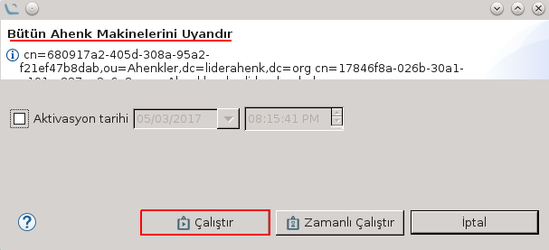

# WOL Eklentisi

Wake-on-LAN izni verilmiş olan makineleri uzaktan uyandırmayı ve açık olan bir ahenk makinesini kapatmayı sağlar.

WOL, bir görev eklentisidir. Bir makineyi ya da makineleri uyandırmak için eklentinin kurulu olduğu   çevrimiçi herhangi bir Ahenk makinesi üzerinden uyandırma komutu gönderilir. Açık Ahenk makinesini kapatmak için ise ilgili makine üzerinde kapatma görevi çalıştırılır.

Uyandırma ekranındaki Mac Adresleri alanına uyandırılmak (açmak) istenen makinenin mac adresi ya da adresleri yazılır (Eğer birden fazla adres yazılacaksa adresler arasına virgül konur.).

Makinenin açık olup olmadığının kontrolü kullanıcının isteğine bağlıdır. Eğer kullanıcı- kontrolün   yapılmasını   istiyorsaUyandırma Kontrolü seçeneğini işaretler. Bundan sonra karşısına doldurması zorunlu olan üç alan çıkacaktır: Ip Adresleri, Portlar ve Süre.

* Ip Adresleri kısmına uyandırılan makinenin ip adresi/adresleri yazılır.

* Portlar alanına uyandırma kontrolü hangi portlar üzerinden yapılacaksa o portlar girilmelidir. Portların ilgili makinede açık olup olmadığına dikkat edilmelidir.

* Son olarak uyandırma kontrolünün uyandırma komutu gönderildikten kaç saniye sonra yapılacağı sorusu yer almaktadır. Bu  alana default değer olarak 30 saniye tanımlanmıştır. Uyandırma komutu gönderilen bilgisayarın normal açılış süresine göre bu alan kullanıcının isteği doğrultusunda değiştirilebilir.

Gerekli alanlar doldurulduktan sonra  **"Ekle"**  butonuna basılarak uyandırılmak istenen makine listeye eklenir. Eğer birden fazla makine uyandırılmak isteniyorsa yukarıdaki adımlar takip edilerek aynı şekilde listeye yeni makine  eklenir.

*(Eğer uyandırılmak istenen makine Ahenk makinesi değilse makine üzerinde **Wake-on-LAN izninin verilmiş olmasına** dikkat edilmelidir.)*

Bir gruptaki bütün Ahenk makinelerini tek bir seferde uyandırmak için ise ilgili grup üzerinde **“Uyandır”** komutu çalıştırılır.

WOL eklentisinde bulunan bir diğer görev ise makineyi kapatma görevidir. Bunun için kapatılmak istenen Ahenk makinesi üzerinde **"Makineyi Kapat"** görevi çalıştırılır.

