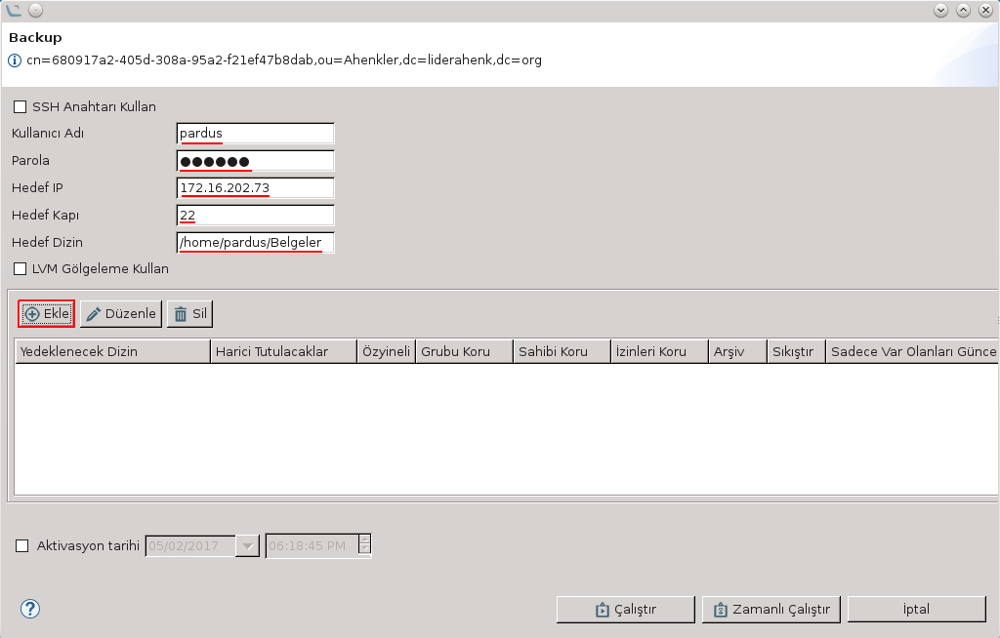

# Yedekleme Eklentisi

Dizinlerin yedeklenmesini sağlayan eklentidir. Eklenti, hem görev hem de politika özelliğine sahiptir.

**"Kullanıcı Adı, Parola, Hedef IP, Hedef Kapı**" ve **"Hedef Dizin"** alanları doldurulur. SSH- anahtarı kullanılacaksa **"SSH Anahtarını Kullan"** seçeneği, LVM Gölgeleme kullanılacaksa **"LVM Gölgeleme Kullan"** seçeneği seçilir.

Ekleme butonuna basılmasıyla birlikte yedeklenecek dizinin nasıl yedekleneceği ile ilgili ekran açılır. Bu ekranda yedeklenmesi istenilen dizinin yolu yazıldığı gibi eğer harici tutulacak dizin varsa bu dizin de Harici Tutulacaklar alanında belirtilir.

Eklentinin politika tarafı da görev tarafıyla aynı yapıya sahiptir.