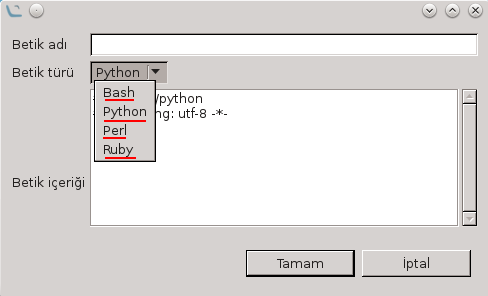
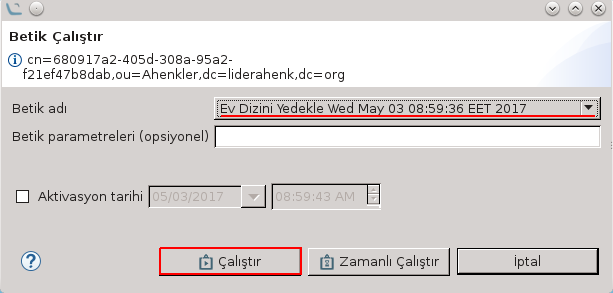

# Betik Eklentisi

Betik eklentisi, özel olarak yazılmış betik dosyalarının Ahenk makinelerde çalıştırılmasını sağlayan bir görev eklentisidir.

Betik oluşturmak ve var olan betik tanımlarına ulaşmak için sol üst menüde bulunan **"Lider -> Betik Tanımları"** seçenekleri takip edilir. Açılan pencerede sol üst menüde bulunan **"Ekle"** butonuyla yeni betik eklenebilir, tabloda bulunan betik tanımlarına çift tıklanarak ya da sol üst menüdeki **"Düzenle"** butonuna basarak kayıtlar güncellenebilir.

Yeni bir betik tanımı ekleneceği zaman açılan pencere aşağıdaki gibidir.

Betik türü olarak **bash, python, perl** ve **ruby** seçenekleri mevcuttur. Betik içeriği girilerek **"Tamam"** butonuna tıklandığı takdirde betik oluşturulur.

Oluşturulmuş olan betikleri çalıştırmak için bir ya da daha fazla ahenk makina seçilir. Sağ tıklama ile  açılan menüde **"Görev Çalıştır -> Betik Çalıştır"** seçenekleri takip edilir.  Açılan pencere aşağıdaki gibidir.

Oluşturulan betiklerden biri seçilir ve betik parametreleri (eğer var ise) belirtilerek görev çalıştırılır.

