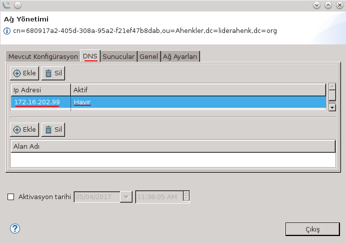
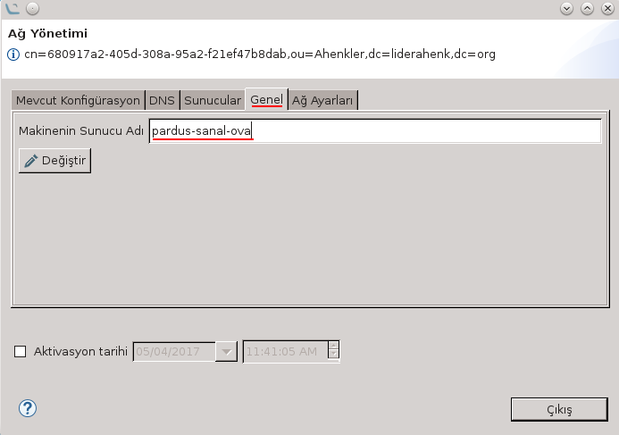

# Ağı Yönet Eklentisi

Eklenti görev şeklinde çalışmaktadır. Herhangi bir Ahenk üzerine uygulandığında o Ahenk üzerindeki ağ ayarlarını okuyarak ekrana getirir.

Ahenk üzerinde daha önce tanımlanmış olan dns konfigürasyonuna **"DNS"** sekmesinden erişilebilir.

**"Ekle"** simgesine tıklanarak yeni bir dns tanımlanabilir. Bu ekranda belirlenen dns ip adresi tanımlandıktan sonra  dns ayarının aktif-pasifliği belirlenebilir.

**"Çalıştır"** simgesine tıklanarak yeni dns adresi Ahenk üzerine uygulanabilir.

Ekran kapatılarak yeniden **"Ağı Yönet"** denilerek girilen dns adreslerinin Ahenk üzerinde bulunduğu kontrol edilebilir. Tanımlanan dns **"Sil"** simgesine tıklanarak kaldırılabilir.

Ahenk üzerinde **"/etc/hosts"** adresinde daha önce tanımlı olan sunucu adresleri **"Sunucular"** ekranında görülebilir. 

**"Ekle"** simgesi ile yeni  sunucu(ların) tanımlaması yapılabilir.

Yine Ahenk üzerinde **"/etc/hostname"** altında tutulan makine adı **"Genel"** sekmesinden değiştirilebilir. Yeni sunucu adı girildikten sonra **"Değiştir"** simgesi ile yeni makine adı Ahenk üzerine uygulanır.

Ekran kapatılarak yeniden **"Ağı Yönet"** denilerek girilen makine  adının Ahenk üzerinde değiştiği kontrol edilebilir.

**"Ağ Ayaları"** sekmesi ile Ahenk üzerine yeni bir ağ ayarı yapışlandırması yapılabilir.

 **"Ekle"** simgesine tıklandığında gelen ekranda **"Tip"** değeri ile ağın **"STATIC"**,**"LOOPBACK"** ve **"DHCP"** seçimi yapılır. Seçime göre alt değerlerin düzenleme seçeneği aktif-pasif olur.
 

Bu ekrana gerekli değerler girilerek **"Çalıştır"** simgesine tıklanmalıdır.
