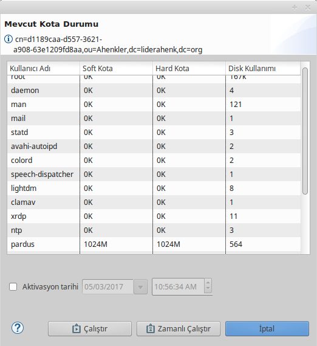

# Disk Kotası Eklentisi

Herhangi bir kullanıcıya ait soft kota ve hard kota sınırlarının belirlenmesiyle bir makine üzerindeki bütün kullanıcıların kota durumlarının görülmesini sağlar. Eklenti, hem görev hem de politika özelliğine sahiptir.

## Disk Kota Profil

Herhangi bir kulllanıcı ya da kullanıcılara ait soft kota, hard kota ve varsayılan kota tanımlaması yapılmaktadır.

Politika uygulanırken başlangıç ve bitiş tarihi verildiği taktirde verilen bitiş tarihinden sonra kullanıcının kotası varsayılan kota değerine alınmaktadır.

**E-posta Gönder** onayı verilerek mail ayarlarına tanımlanan adreslere bilgi gönderimi yapılabilir veya onay işareti kaldırılarak gönderim iptal edilebilir.

## Disk Kota Görev

Eklentinin görev tarafında ilgili Ahenk makinesinin bütün kullanıcılarının kota durumu getirilmektedir. Bunun için kullanıcının ek olarak bir şey yapmasına gerek yoktur. Görev çalıştırıldıktan kısa bir süre sonra bütün kullanıcılar kota durumları (soft kota, hard kota) ve disk kullanımlarıyla birlikte listelenecektir.

Eklentinin profil tarafında ise bir kullanıcının soft kota, hard kota ve varsayılan kota sınırları belirlenmektedir.
