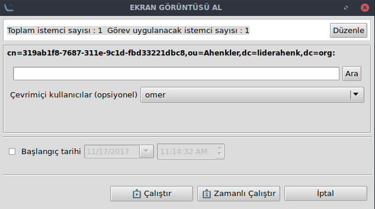

# Ekran Görüntüsü Eklentisi

Herhangi bir ahenk makinesinden ekran görüntüsü almayı sağlayan eklentidir.

Ekran Görüntüsü, bir görev eklentisidir.

Ekran görüntüsünü almak için ilgili makine üzerinde  görev çalıştırılır. Çevrimiçi kullanıcılar alanında makine üzerindeki bütün çevrimiçi kullanıcılar açılır menüsünde listelenmektedir. **Ara** butonuna tıklanarak çevrimiçi kullanıcılar arasında arama işlemi yapılabilir.

**"Çalıştır"** simgesine tıklandığında Ahenk tarafında kullanıcıya ekran görüntü alınması için izin ekranı getirilir.

Kullanıcı onay verdiğinde ekran görüntüsü sunucuya alınır.

**Not:** *Kullanıcıdan izin alma arzu edildiği taktirde kaldırılabilir. Sistem yöneticisi herhangi bir onay almadan da ekran görüntüsü alınabilmektedir.*

Ekran görüntüsü alma işlemi gerçekleştirildikten sonra alınan ekran görüntüsü **"Lider-Console"** kullanıcısının karşısına getirilir. **"Dosyayı indir"** seçeneğiyle bu ekran görüntüsü,bilgisayar üzerinde kullanıcının belirlediği herhangi bir lokasyona kaydedilir.

