Kurulum adımları;

* Veritabanı Sunucusu(MariaDB)
* LDAP(slapd)
* XMPP(Ejabberd)
* Dosya Sunucu
* KARAF(Lider)

bileşenlerinden oluşmaktadır.

##LiderAhenk Depo

LiderAhenk kurulumu için gerekli paketler "repo.liderahenk.org" deposunda bulunmaktadır. Deponun sisteminize tanımlanması için uçbirim(konsol)da;

	sudo wget http://repo.liderahenk.org/liderahenk-archive-keyring.asc && sudo apt-key add liderahenk-archive-keyring.asc &&  rm liderahenk-archive-keyring.asc

komutları ile "liderahenk-archive-keyring.asc" key dosyası indirilerek sisteme yüklenmelidir. Ardından;

	sudo add-apt-repository 'deb [arch=amd64] http://repo.liderahenk.org stable main'

komutu ile depo adresi "/etc/apt/sources.list" dosyasına eklenir. Bu adımı uçbirimde bir metin editörü(vi,nano,pico) yardımı ile ;

	deb [arch=amd64] http://repo.liderahenk.org stable main

satırını "/etc/apt/sources.list" dosyasına elinizle de tanımlayabilirsiniz. Daha sonra;

	sudo apt update

komutu ile güncel paket listesi alınarak kurulumlara başlanmalıdır.

##Veritabanı Sunucusu##

Veritabanı olarak  MariaDB kullanılmaktadır. Veritabanları birbirleriyle ilişkili bilgilerin depolandığı alanlardır. Lider Sunucu veritabanıdır. Bir kez kurulur.

	sudo apt install mariadb-server -y

Kurulum işlemleri aşamasında mariadb-server root şifresi ekrana gelir.

Bu örnekte root şifresi **SIFRE**  olarak ayarlanmıştır.

Aynı şifre tekrar girilip **enter** tuşu ile kurulum işlemine devam edilir. Kurulum işlemi başarı ile gerçekleştikten sonra artık **mariadb-server** kurulumu tamamlanmış demektir.

Kurulum başarı ile sonlandıktan sonra LiderAhenk sistemi için utf8 karakter setini kullanan liderdb adında bir veritabanı oluşturulması gerekiyor. Bu işlemi tamamlamak için Linux konsol da aşağıdaki komutun çalıştırılması yeterli olacaktır.

	mysql -uroot -pSIFRE -e "CREATE DATABASE liderdb DEFAULT CHARACTER SET utf8 DEFAULT COLLATE utf8_general_ci"

Not: Eğer mariadb-server kurulu sunucu lider kurulumu yapılacak sunucudan bağımsız bir sunucu olacak ise, mariadb konfigürasyon dosyasında (/etc/mysql/my.cnf ) yer alan bind-address parametresi satırının önüne **#** simgesi yazılarak yorum şekline getirilmelidir. Bu sayede servis başka sunucuların erişimine açılmış olacaktır. 

	#bind-address	 = 127.0.0.1

şeklinde bu satır kapatılabilir veya lider-sunucu ip adresi yazılabilir. Lider sunucunun veritabanı sunucusundaki veritabanına ulaşması için liderdb database grant yetkilerinin verilmesi gerekir. Bunun için;

	mysql -uroot -pSIFRE

ile giriş yapılır,

	use liderdb;

ile veritabanı seçilir, daha sonra;

	select password('SIFRE'); 

komutu ile 41 karakter hexadecimal şifre üretilir. Daha sonra 

	grant all privileges on * to root@' %' identified by 'hexadecimal_karakterler' ;

komutu ile grant yetkisi verilir.

	exit

komutu ile mariadb'den  çıkılır.

	sudo systemctl restart mysql.service

Yapılan düzenlemerin geçerli olması için yukarıdaki komut çalıştırılarak  mariadb servisi yeniden başlatılır.

Veritabanın doğru şekilde kurulduğunu kontrol etmek için, veritabanının kurulu olduğu makinenin komut satırına gelerek;

	mysql -uroot -pSIFRE

yazılarak (burada sifre mariadb-server kurulum adımında belirlenen root şifresidir.) mariadb monitor ekranına giriş yapılır.

	show databases;

komutu ile veritabanlarının listesini alabiliriz. **liderdb** veritabanları listesi altında olduğu görülüyor ise veritabanı başarılı şekilde oluşturulmuştur.

##LDAP Sunucu##

LDAP bileşeni için bu örnekte OpenLDAP kullanılacaktır. LiderAhenk, kullanıcı ve makine yönetimi için LDAP'a ihtiyaç duymaktadır. Kullanıcı ve makine bilgileri LDAP üzerinde tutulur ve Lider-Console (LiderAhenk arayüz uygulaması) 'dan bu ldap'a bağlanarak politika yönetimi yapılır. Bir kez kurulur.

	sudo apt install slapd ldap-utils

komut sonrasında paket yöneticisi slapd kurulumu için ön gereksinim ya da gereksinimler var ise kurulacak bu bileşenlerin listesini gösterir ve kurulum için **E/e** onay bekler.

**Enter** tuşu yardımı ile kurulum onaylandıktan sonra, doğrulanmamış paketler var ise tekrar bu paketlerin kurulumu için **e/E** onay ekranı gösterilir. **E** yazıp **Enter** tuşuna basarak bu işlemi de onayladıktan sonra paket yöneticisi gerekli paketleri indirme ve kurma işlemine başlar.

Slapd kurulum sırasında kullanıcıdan bir yönetici (administrator)  parolası belirlenmesini ister. Bu örnekte kullanıcı parolası **SIFRE** olarak belirlenmiştir.

Parola bilgisi olarak **SIFRE** girildikten sonra paket parolayı doğrulamanız için sizden tekrar girmenizi isteyecektir.

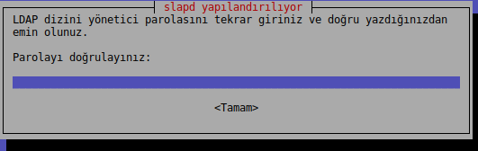

Yine SIFRE girdikten sonra **enter** tuşuna tıklayarak kurulumun devam etmesi sağlanır.

Paket yöneticisi slapd servisini başlattıktan sonra kurulumu tamamlar. Open LDAP temel kurulumu bu şekilde tamamlanmış olur.

Şimdi ldap dizin(veritabanı) ve dizin yöneticisi kullanıcısı oluşturmak için openldap konfigürasyonu yapalım. Bunu için;

	sudo dpkg-reconfigure slapd

komutunu çalıştırılmalıdır.

**Hayır** seçeneği seçilerek devam edilir.

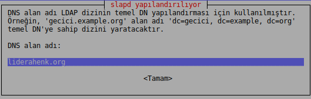

Bu adımda temel dn adı verilir. Örneğin; **“liderahenk.org”** şeklinde alan adı girilerek **"dc=liderahenk,dc=org”** şeklinde temel DN'ye sahip dizin oluşturacaktır. **“liderahenk.org”**  şeklinde dn bu alana yazılır.

Bu adımda örgüt adı (organizational name) girilmelidir. Bu alana kurum adı veya birim adı girilebilir. Örneğin; **“LiderAhenk"**

Slapd konfigure edilirken tekrar şifre ister, bir önceki adımda verilen şifre **SIFRE** verilir.

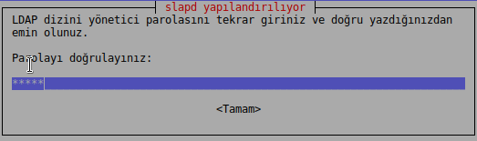

Aynı şifre girilerek **Enter** tuluna basılır.

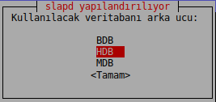

Yukarıdaki seçeneklerden **“HDB”** seçilerek devam edilmelidir.

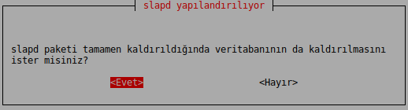

Slapd paketi tamamen kaldırıldığında veritabanının da kaldırılması için **Evet** seçeneği seçilerek devam edilmelidir.

Eski veritabanı taşıma sorusuna **Hayır** cevabı verilerek devam edilir.

Bu örnekte;

 - Ldap domain adı : liderahenk.org
 - Ldap dizin(Veritabanı) adı : dc=liderahenk,dc=org
 - Ldap dizin(Veritabanı) Yönetici Kullanıcısı : cn=admin,dc=liderahenk,dc=org
 - Ldap dizin(Veritabanı) Yönetici Kullanıcısı Şifresi : SIFRE

İşlem adımlarının kontrolünü yapalım. Bunun için bir ldap arayüzüne ihtiyacımız var. Bu örnekte test işlemi için **Apache Directory Studio** kullanılacaktır.  Apache Directory Studio ldap arayüzünü https://directory.apache.org/studio/download/download-linux.html adresinden indirip kullanabilirsiniz.

Apache directory studio açıldıktan sonra sol tarafta bulunan bağlantılarım(connections) bölümüne sağ tıklayarak yeni bağlantı oluştur seçilir.

Burada ;

 - Bağlantı adı (İsteğe bağlı bir bağlantı adı)
 - Hostname (İp, sunucuda açılıyorsa localhost girilebilir)
 - Port (Ldap portu)

bilgileri girilir. 

Bağlantıyı kontrol et ile (Check network parameters) ile bağlantının doğruluğu kontrol edilir.

Bağlantı başarılı olmalıdır.

Ldap dizin (veritabanı) yöneticisi kullanıcı adı ve şifre(SIFRE olarak tanımlanmıştı) yazılarak, kullanıcı otantikasyonu test edilir. 

Bağlantı başarılı sonucu vermelidir.

Bir sonraki adımda, Base DN ayarlaması yapılır. Buraya daha önce oluşturulan dizin(veritabanı adı girilir.) ve bitir ile bağlantı gerçekleştirilir.

LDAP sunucunuzun yapılandırma erişimi için bir şifre belileyin ve bunu LDAP şifre satırı haline getirin. Bunun için;

	sudo su
	slappasswd

Komutu ile “yapılandırma(konfigürasyon) kullanıcısı” şifresi  girmenizi isteyecektir.  Be şifre LDAP sunucunuzun yapılandırma erişimi için gerekmektedir.

	New Password: <şifrenizi giriniz>
	Re-enter new password: <şifrenizi tekrar giriniz>
	{SSHA}KopyalayacağınızŞifreSatırı

ekranda beliren şifreyi kopyalayınız ve bu şifreyi;

	sudo pico /etc/ldap/slapd.d/cn=config/olcDatabase={0}config.ldif 

dosyanın içerisindeki olcRootDN: satırının altına

	olcRootPW: {SSHA}KopyalayacağınızŞifreSatırı

şeklinde kopyalayın, OpenLDAP sunucunuzu durdurun ve bunun için aşağıdaki komutu çalıştırın.

	systemctl stop slapd.service

OpenLDAP sunucunuzu aşağıdaki komut ile  yeniden başlatabilirsiniz.

	systemctl start slapd

Burada yapılandırma(konfigürasyon) yöneticisi kullanıcı adı **“cn=admin,cn=config”** dir.  Şimdi lider ahenk şemalarını ldap'a yükleyelim. Bu şemelar ldap düğümleri oluşturma adında, düğümlere 

	- parduAccount
	- pardusLiderAhenkConfig
	- pardusLider

nesne sınıflarını oluşturmayı sağlar. 

Daha sonra liderahenk.ldif dosyası konsolda 

	sudo wget https://github.com/Pardus-LiderAhenk/lider-ahenk-installer-console/blob/master/lider-installer/conf/liderahenk.ldif && sudo cp liderahenk.ldif /tmp

adresinden indirilerek **/tmp** klasörü altına kopyalanır. Lider ahenk şemaları varolan ldap'a yüklenmelidir. Bunun için ;

	ldapadd -x -f /tmp/liderahenk.ldif -D "cn=admin,cn=config" -w $CNCONFIGADMINPASSWD

komutu ile ldif ldap'a yüklenir. Burada **cn=admin,cn=config** config kullanıcısı,  **$CNCONFIGADMINPASSWD** yapılandırma(konfigürasyon) kullanıcısı şifresidir. Bir önceki adımda belirlenmiştir. Örneğin;

	ldapadd -x -f /tmp/liderahenk.ldif -D "cn=admin,cn=config" -w SIFRE

şeklinde olmalıdır.

Bu dosya herhangi bir ldap arayüzü ile ldap'a bağlanarakta sisteme yüklenebilir. Bu yüklemeden sonra ldap yeniden başlatılmalıdır. Bunun için aşağıdaki komutu çalıştırın.

	sudo systemctl restart slapd.service

NOT : Ldap yeniden başlatılmaz ise lider nesne sınıfları ldap düğümleri oluşturulurken görüntülenmeyecektir.

Apache Directory ile Ldap üzerinde;

	* liderAhenkConfig Düğümü
	* lider_console Kullanıcısı
	* Ahenkler, Kullanıcılar Gurubu

düğümleri oluşturulur. Temel DN (bu örnekte dc=liderahenk,dc=org) üzerine;

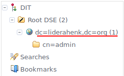

sağ tıklandıktan sonra **“new/New Entry”** adımları izlenerek oluşturulur.

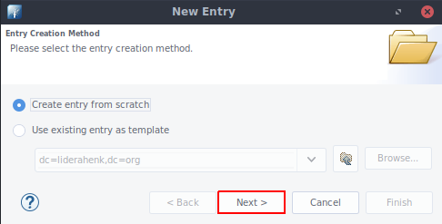

için “Sonraki(Next)” tuşuna tıklayarak devam edilir.

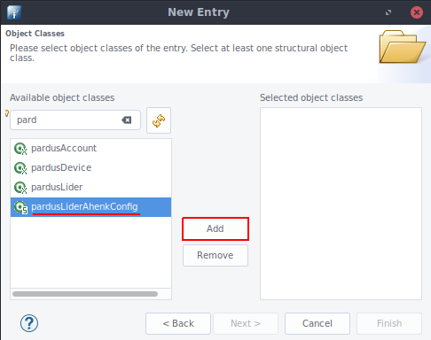

LiderAhenkConfig düğümü için “pardusLiderAhenkConfig” nesnesini seçip “Ekle(Add)” ile resimde görüldüğü üzere “Seçilmiş nesne sınıfı(Selected object classes)” bölümü eklenir.  Bir sonraki adım için “Sonraki(Next)” tuşuna tıklayarak devam edilir.

“RDN”  alanı “cn” olarak belirlenir ve “liderAhenkConfig” yazılarak devam edilir.
Bunun ardından liderServiceAddress değişkenine

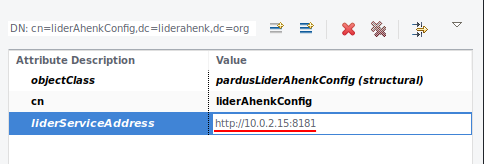

lider sunucu ip adresi http://x.x.x.x:8181 olarak yazılır.
Burada lider sunucu ip adresi ahenk makinelerinin ve lider sunucunun erişebileceği şekilde olmalıdır.
Not:Belirlenecek ip adresi 127.0.0.1 olmamalıdır !

Lider konsol kullanıcısı oluşturmak için Ldap temel düğümü üzerinde  sağ tıklanarak;

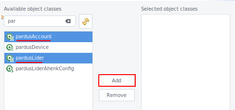

pardusAccount, pardusLider nesne sınıfları ve

inetOrgPerson nesne sınıfları seçilerek “Ekle(Add)” tuşuna tıklanarak “Seçilmiş nesne sınıfı(Selected object classes)” alanına eklenenir.

“RDN” alanı  “cn” olarak belirlenir ve “lider_console” yazılarak lider konsol kullanıcısı oluşturulur.

Lider konsol kullanıcı şifresi belirlenir. “Tamam(OK)” tuşuna tıklanarak düzenleme tamamlanır.

Ldap düğümü üzerinde “lider_console” seçili iken ;

sağ tıklanarak gelen menüde  “Yeni Öznitelik (New Attribute)” seçeneğine tıklanır ve  aşağıdaki resimde görülen “Öznitelik Tipi(Attibute type)” alanı  açılır.  Bu alanda; 

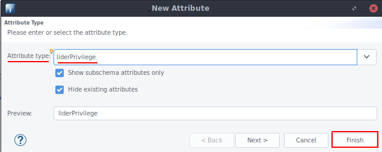

Öznitelik tipi(Attribute type)  liderPrivilege olarak seçilir. Bu alan lider konsol kullanıcısının yetkisinin belirlendiği alandır ve değer olarak;

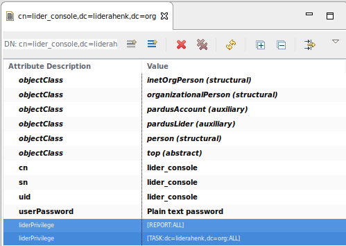

[TASK:dc=liderahenk,dc=org:ALL:true] şeklinde belirlenir. Aynı şekilde yeni bir öznitelik ekleyerek [REPORT:ALL] verilir.

Burada dc=liderahenk,dc=org yerine ilgili veritabanı temel ismi yazılır. Bu temel isim ilgili kullanıcının yönetmesini istediğimiz düğüm anlamına gelmektedir. Bu kullanıcıya veratabanı temel ismini vererek bütün ldap ağacını  yönetebilir demiş oluyoruz. ALL bütün eklentileri yönetebilir anlamına gelmektedir. True ise aktif durumda olduğunu gösterir.

Ahenkler, Kullanıcılar grublarını oluşturmak için ldap temel ismine sağ tıklayarak yeni düğüm oluştur seçeneği seçilir. Nesne sınıfını belirlemek içim “Next” tuşuna tıklayarak devam edilir.

Ahenkler düğümü için gelen menüde “organizationalUnit”  nesne sınıfı eklenir.

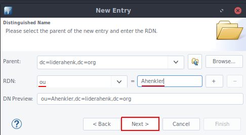

**“RDN”**: alanı  **“ou”** olarak belirlenir ve  **“Ahenkler”**  yazılarak  grup oluşturulur. Ahenkler grubu seçili iken sağ tıklanır, gelen menüde **"New Attribute"** seçillerek **"Attribute Type"** alanına **"description"** yazılır ve **"Finish"**'e tıklanır. Daha sonra bu alana **"pardusDeviceGroup"** yazılır. Bu adım **"Ahenkler"** grubu gibi oluşturulan tüm ahenk gruplarına uygulanmalıdır.

Aynı adımlar takip edilerek **"Kullanıcılar"** gurubu oluşturulur(Description tanımlaması sadece ahenk gruplarına uygulanır, kullanıcı gruplarında bu adıma gerek yoktur).

Son durumda ldap ağacı üzerinde son durum;

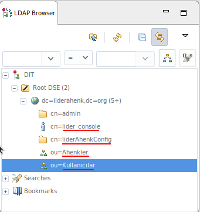

şeklinde olmalıdır.

##XMPP Sunucu##

Xmpp (Ejabberd)  "Genişletilebilir Mesajlaşma ve Varlık Protokolü" olarak adlandırılır. Komut satırında;

    sudo apt install ejabberd=16.06-0 -y

komutu ile kurulur.

Bütün ahenklerin bağlandığı bileşendir. Lider Sunucu ve ahenkler bu bu bileşen üzerinden haberleşirler. Bir kez kurulur. 

Kurulum sonrası konfigurasyon için konsolda;

	wget https://github.com/Pardus-LiderAhenk/lider-ahenk-installer-console/blob/master/lider-installer/conf/ejabberd.yml

adresinde  bulunan  ***ejabberd.yml***  dosyasını;

	sudo cp ejabberd.yml /opt/ejabberd-16.06/conf/

***/opt/ejabberd-16.06/conf/ejabberd.yml*** dosyasının yerine kopyalayınız. Kopyalama işleminden sonra gerekli konfigürasyon için aşağıdaki yolları izleyiniz.

Not: Bu konfigürasyon  **“ejabberd ejabberd-16.06”** versiyonuna göre **ejabberd.yml** dosyasında yapılmıştır. Farklı bir sürümde yml dosyası değiştiği için bu yml için belirlenen ayarlar değişkenlik gösterebilir. Bu nedenle sürüm ve yml dosyalarının yukarıda kurulan sürümlerle aynı olmasına dikkat ediniz.

**ejabberd.yml** dosyasını konsolda bir editör ile açınız;

	sudo pico /opt/ejabberd-16.06/conf/ejabberd.yml

Açılan dosyada aşağıdaki satırlara gerekli bilgiler tanımlanır.

	hosts:
		 #	- "localhost"
 		- "#SERVICE_NAME"

***localhost*** satırı kapatılır, altına kullanılacak ***#SERVICE_NAME** (Örn: liderahenk.org) tanımlaması yapılır.

	ldap_servers:
   		- "#LDAP_SERVER"

***ldap server*** farklı bir bilgisayarda ise ip, lider sunucu ile aynı bilgisayar ise ***localhost*** satırı açık kalmalıdır.

	ldap_rootdn: #LDAP_ROOT_DN"

***ldap rootdn***(Örn:"cn=admin,dc=liderahenk,dc=org") tanımlaması değiştirilir.

	ldap_password: "#LDAP_ROOT_PWD"

***ldap password*** (Örn: "SIFRE" ) admin şifresi buraya tanımlanır.

	ldap_base: "#LDAP_BASE_DN"

***ldap base dn*** (Örn: "dc=liderahenk,dc=org" ) bilgisi girilir.

	host_config:
	   "#SERVICE_NAME":
     	  auth_method:
       	    - internal
       	    - ldap
       	    - anonymous

***host_config*** (Örn: "im.liderahenk.org": )satırları yukarıdaki şekilde olmalıdır. 

Not: Ejabberd.yml dosyası çok hassas bir dosyadır, herhangi boşluk veya karakter hatasında çalışmayabilir. Bu nedenle konfigurasyon dosyasında mümkün olduğu kadar varolan ayaların üzerinde değişiklik yapılarak gidilmelidir. Yeni satır eklemek veya başka bir yerden veri kopyalamak hataya neden olabilmektedir.

***Ejabberd.yml*** konfigürasyon dosyası düzenlendikten sonra ejabberd sunucusu aşağıdaki komutlar yardımı ile yeniden başlatılır.

	cd /opt/ejabberd-16.06/bin
    sudo ./ejabberdctl start

daha sonra

	sudo ./ejabberdctl status

komutu ile alınan çıktıda 

    The node ejabberd@localhost is started with status: started
    ejabberd 16.06 is running in that node

cevabı alınmış olmalıdır. Aksi halde yml dosyasına dönülerek ayarlar kontrol edilmelidir.

Ardından gerekli grup ve kullanıcıların oluşturulması işlemine gelir. Bu işlemler için sırası ile aşağıdaki komutlar çalıştırılır. Komutlar ***/opt/ejabberd-16.06/bin*** dizini altında çalıştırılmalıdır.

	cd /opt/ejabberd-16.06/bin

ile ***bin*** dizini altına gidilir. ***Ejabberd Admin*** kullanıcısı oluşturmak için;

	./ejabberdctl register admin  #SERVICE_NAME #ejabberd_admin_pass
    
şeklinde #SERVICE_NAME (Örn: im.liderahenk.org)  bilgisi ve #ejabberd_admin_pass (Örn: SIFRE) bilgileri girilir.
Alınan cevap;

	User admin@#SERVICE_NAME successfully registered

şeklinde olmalıdır.
Admin kullanıcsıından sonra birde KARAF tarafından kullanılacak lider_sunucu(Farklı bir isim verilerbilir, fakat bu kullanıcı adı Karaf kurulumunda da verileceği için not edilmelidir) kullanıcısı oluşturulmalıdır. Bu senaryoda sadece 1 adet lider sunucusu olacağı varsayılarak lider_sunucu adında sadece 1 adet kullanıcı oluşturulmuştur. Eğer birden fazla lider sunucusu çalıştırılacak ise her birisi için aşağıdaki gibi bir kullanıcı oluşturulmalı ve daha sonra tanımlanacak lider yapılandırma ayarlarında her bir lider sunucusu için girilmelidir.

	./ejabberdctl register lider_sunucu #SERVICE_NAME #ejabberd_admin_pass
	./ejabberdctl restart

Bu şifreler daha sonra yapılandırma ayarlarında kullanılacak olduğu için unutulmamalıdır.

NOT: Ejabberd sunucusu lider ve diğer sunuculardan bağımsız ayrı bir sunucu üzerinde çalıştırılacak ise, yukarıdaki konfigürasyon örneğinde yer alan portların dışarıdan ulaşılabilir olması için gerekli firewall ayarlarının yapılması gerekmektedir.

Xmpp sunucusunun son durumda hatasız kurulduğunun testlerinin yapılması için; 

	./ejabberdctl stop

servisi durduruyoruz.

	./ejabberdctl live

komutu ile ejabberd sunucusu çalıştırılır. Bu çalışma sırasında ejabberd herhangi bir hata alıp çıkmıyor ve açık kalıyorsa kurulumumuz doğru yapılmış demektir. Aksi durumda kurulum adımını tekrar kontrol ediniz. Bu adımdan sonra;

	Ctrl + C 

ile live çalışma modundan çılır ve;

	./ejabberdctl start

ile ejabberd sunucusu tekrar başlatılır. 

##Dosya Sunucu##

Eklentilerin üzerinde tutulacağı ve mesajlaşma ile yapılamayacak boyuttaki işlemlerin (ssh şeklinde)  dosya aktarımı için kullanıcılacak sunucudur. Herhangi bir ssh ile erişimi sağlanacak bilgisayar olabilir, tercihen lider sunucuyu kullanıyoruz. Aşağıdaki paketler dosya aktarımı ve iletişim için gereklidir;

	sudo apt install sshpass rsync -y

komutu ile kurulum tamamlanır.

##Lider Sunucu##

Lider Sunucu, liderahenk uygulamasının merkezinde yer alır.  Xmpp ile bütün ahenklerin yönetimi bu sunucu üzerinden yapılır. Bunun yanında üzerindeki rest servisler ile Lider-Console  ( LiderAhenk arayüz uygulaması ) ile ilteşim sağlayarak arayüzden yönetime olanak sağlar. Bir kez kurulur.

JAVA_HOME çevresel değişkeni sisteme tanımlanmalıdır. Bunun için;

	update-alternatives --config java

komutu ile sistemde kurulu java sürümü ve yolu görüntülenir. eğerbir java sürümü yoksa;

	sudo apt install openjdk-8-jre

komutu ile Openjdk-8-jre sisteme yüklenir.
Not: Farklı bir sürüm kullanılacaksa java sürümü ve yolu ona göre tanımlanmalıdır.

	sudo pico ~/.bashrc

ile açılan dosyanın en atına;

	export JAVA_HOME=”/usr/lib/jvm/{sdk ev dizini}”

ve

	PATH=”$PATH:/usr/lib/jvm/{sdk ev dizini}/bin”

Burada {sdk ev dizini} ile belirtilen yere sdk ev dizini adı gelir. Bu adımdan sonra

	source ~/.bashrc

ile yeni çevresel değişkenler sistem tarafından tanınmış hale gelir. (Bu adımda makinenin yeniden başlatılması önerilir. )
Bu işlemin testi için;

    echo $JAVA_HOME

ekrana oracle sdk ev dizini yolunu ekrana çıktı olarak veriyorsa işlem doğru yapılmış demektir.

**Lider Sunucu**'yu;

	sudo wget https://github.com/Pardus-LiderAhenk/lider/releases/download/v1.1/lider-distro-all_1.1.tar.gz

adresinden indirerek;

    sudo cp lider-distro-all_1.1.tar.gz /opt && cd /opt

komutu ile /opt dizini altına atınız;

	sudo tar -xvf lider-distro-all_1.1.tar.gz

komutu ile açınız.

Lider-sunucu (karaf) uygulamasının bir servis olarak ayarlanması için öncelikle uygulama manuel olarak başlatılır. Bunun için lider-sunucu dosyalarının bulunduğu klasöre aşağıdaki komut ile gidilir.

	cd /opt/lider-distro-1.1/bin

ve bu klasör içerisindeyken, uygulamayı başlatmak için uygulama dosyası aşağıdaki gibi çalıştırılır.

	sudo ./karaf

Karaf uygulaması çalıştığında konsol uygulama ekranına düşer, karaf modülleri ayağa kalktıkması beklenir. Ayağa kaltığını anlamak için konsola list yazılır ve uygulama durumları karaf üzerinde listelenir. Liste içerinde uygulama durumunda failure durumu varsa, sorun giderme başlığında lider sunucu adımında kurulum kontrolleri yapılarak kuruluma devam edilir.
bin/karaf
Servis dosyalarının oluşturulması için aşağıdaki komut karaf konsolda çalıştırılır.

	feature:install wrapper

sonra;

	wrapper:install -s AUTO_START -n KARAF -d Karaf -D "Karaf Service"

bu komut servis olarak çalışması için gerekli dosyaların oluşmasını sağlar. Bu komut ile karaf konsolunda yer alan şeklinde bir takım yazılar belirir. Karaf bu adımdan sonra durdurulur.

Karaf konsolda ;

	logout

yazılarak kapanması sağlanır.

Burada yer alan;

	sudo ln -s /opt/lider-distro-1.1/bin/KARAF-service /etc/init.d/

	sudo update-rc.d KARAF-service defaults

komutları çalıştırılır. Artık karaf, servis olarak çalışmaya hazırdır.

Lider-sunucu yapılandırma dosyasının düzenlenmesi

	sudo pico /opt/lider-distro-1.1/etc/tr.org.liderahenk.cfg

Bu dosya düzenlenmek için açılır;

    ldap.server = localhost
    ldap.port = 389
    ldap.username = cn=admin,dc=liderahenk,dc=org
    ldap.password = SIFRE!
    ldap.root.dn = dc=liderahenk,dc=org

Tüm sunucular aynı ip'de ise **localhost** değeri kalabilir, farklı ipler bu alanlara tanımlanmalıdır. Ldap **admin** şifresi vd dn bilgileri tanımlanır.

    xmpp.host = localhost
    xmpp.port = 5222
    xmpp.username = lider_sunucu
    xmpp.password = SIFRE
    xmpp.resource = Smack
    xmpp.service.name = im.liderahenk.org

Tüm sunucular aynı ip'de ise **localhost** değeri kalabilir, farklı ipler bu alanlara tanımlanmalıdır. Ejabberd da oluşturulan lider_sunucu ve host bilgileri yukarıdaki şekilde tanımlanır.

Ahenklerin hangi ou altında görüleceği bilgisi aşağıdaki gibi tanımlanır. Bu bilgi daha önce Ldap kurulumunda oluşturulan Ahenkler gurubudur.

	agent.ldap.base.dn = ou=Ahenkler,dc=liderahenk,dc=org

Ldap base dn bilgisi tanımlanır.

    user.ldap.base.dn = dc=liderahenk,dc=org

Dosya sunucu kullanıcı adı, şifre bilgieri tanımlanır. Lider sunucudan farklı bir makine dosya sunucu olarak kullanılacaksa **localhost** değeri yerine ip bilgisi tanımlanmalı ve o makinede ssh portu açık, kullanıcının erişm bilgileri doğru tanımlanmalıdır.

    file.server.protocol = ssh
    file.server.host = localhost
    file.server.port = 22
    file.server.username = lider
    file.server.password = PP123456
    file.server.plugin.path = /home/kullanici_adi/plugins/ahenk-{0}_{1}_amd64.deb
    file.server.agreement.path = /home/kullanici_adi/sample-agreement.txt
    file.server.agent.file.path = /home/kullanici_adi/agent-files/{0}/

**/home/kullanici_adi/plugins**, **/home/kullanici_adi/sample-agreement.txt**, **/home/kullanici_adi/agent-files/{0}** dosyaları dosya sunucu üzerinde konsolda;

	mkdir /home/kullanici_adi/plugins && touch /home/kullanici_adi/sample-agreement.txt

	mkdir -p /home/kullanici_adi/agent-files/{0}

komutları ile (**kullanici_adi** dosya sunucudaki kullanıcını home dizinidir) oluşturulmalıdır. Bu dizin ve dosyalar farklı adreslere tanımlanabilir, fakat bu tanımlamalara göre dosya ve dizinlerin oluşturulma  işlemi gerçekleştirilmelidir.

Daha sonra

	sudo pico /opt/lider-distro-1.1/etc/tr.org.liderahenk.datasource.cfg

dosyasında;

    db.server = localhost:3306
    db.database = liderdb
    db.username = root
    db.password = SIFRE

veritabanı konfigürasyonu yapılır. **localhost** alanına ip bilgisi,port, veritabanına erişimi olan kullanıcı ve şifre bilgisi tanımlanır.

Lider sunucu;

	systemctl start KARAF-service.service

komutu ile yeniden başlatılarak lider sunucu kurulumu tamamlanır. Karaf servisinin başladığından emin olmak için 

	systemctl status KARAF-service.service

alternatif olarak

	ps -ef | grep karaf

komutu çıktısına bakılır.  Eğer “start” durumda değilse alternatif olarak;

	/etc/init.d/KARAF-service start

komutu ile karaf çalıştırılır. Karaf servis olarak çalıştırılmışsa;

	ssh -p 8101 karaf@localhost

şifre “karaf” ile sunucu durumu izlenebilir. Hatalı bir durum kontrolu için karaf konsolda;

	log:tail

lider servislerinin aktif olmadığını görmek için karaf konsolda;

	list

komutu çalışıtırılmalıdır.
