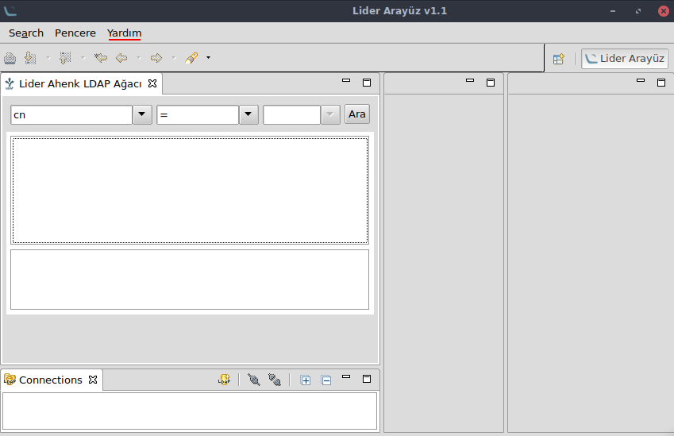
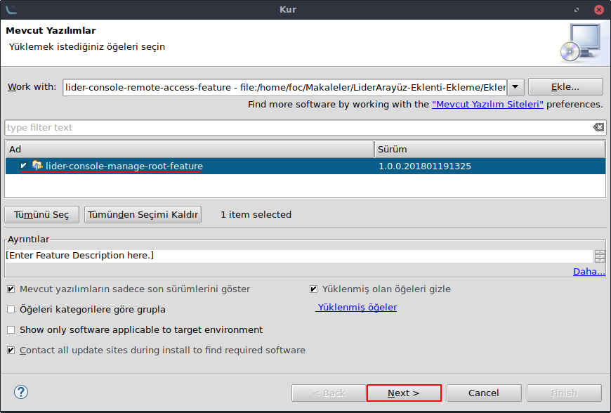
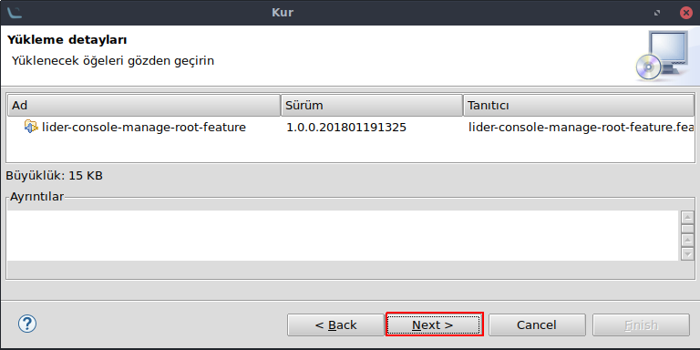
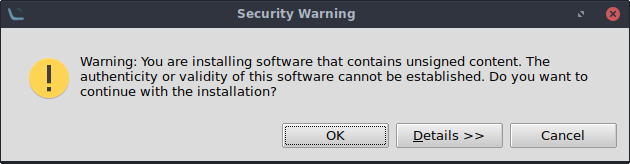
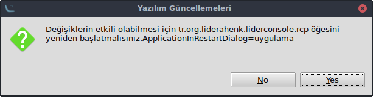

#LiderArayüz - Eklenti Ekleme#
**LiderArayüz Github Sayfası**‘ında tüm eklentileri içeren bir sürüm (**Lider.Console.Core- linux.gtk.x86_64_all-1.1.tar.gz**) ve eklentisiz bir sürüm(**Lider.Console.Core-linux.gtk.x86_64_1.1.tar.gz**) yayınlanmaktadır. Boş bir **LiderArayüz**’e eklenti ekleme adımları anlatılacaktır.

LiderAhenk Github Sayfası [LiderArayüz](http://https://github.com/Pardus-LiderAhenk/lider-console/releases/download/v1.1/Lider.Console.Core-linux.gtk.x86_64_1.1.tar.gz) adresinden uygulamanın boş halini indirerek sağ tıklanır ve arşivden çıkartılır.

[Eklentiler](https://github.com/Pardus-LiderAhenk?utf8=%E2%9C%93&q=plugin&type=&language=) LiderAhenk **Github** sayfasında sunulmaktadır. Eklenmek istenen eklenti için **releases**'a tıklanır ve **.zip** dosyası indirilir. Sağ tıklanarak arşivden çıkarılır.

Eklentisiz LiderArayüz ve eklenti inidirildikten sonra **lider-console** çalıştırılabilir dosyasına çift tıklanarak çalıştırılır.



**Yardım > Yeni Eklenti Yükle..** yolu izlenir.


**Ekle** simgesine tıklanır.


Local.. simgesine tıklanır. Eklentinin bulunduğu dizinde(Örnek olarak Manage-Root eklentisi baz alınmıştır)

```
lider-ahenk-manage-root/lider-console-manage-root-feature/target/site/
```

şeklinde **site** dizinine kadar inilerek bu dizin seçili halde iken **Tamam** butonuna tıklanır.


Daha sonra **OK** butonuna tıklanır. Daha sonra eklenti ismi ve sürümü ile birlikte görüntülenir.



Eklenti seçilerek **Next** butonuna tıklanır.



Yükleme detayları ekranında **Next** butonuna tıklanarak ilerlenir.


Lisans sözleşmesi onayı verilerek **Finish** butonuna tıklanır.
```
Not: Güvenlik uyarısına **OK** butonuna tıklanarak devam edilir.
```


Eklenti kurulumu tamanlandı. Uygulamanın yeniden başlayarak eklenti ile birlikte çalışması sağlanır. Bunun için **Yes** butonuna tıklanır.



Yeniden başlayan uygulama ile bağlantı açılarak herhangi bir **ahenk-kullanıcı** üzerine tıklandığında görev listesinde yeni eklenen eklenti görülebilir.


