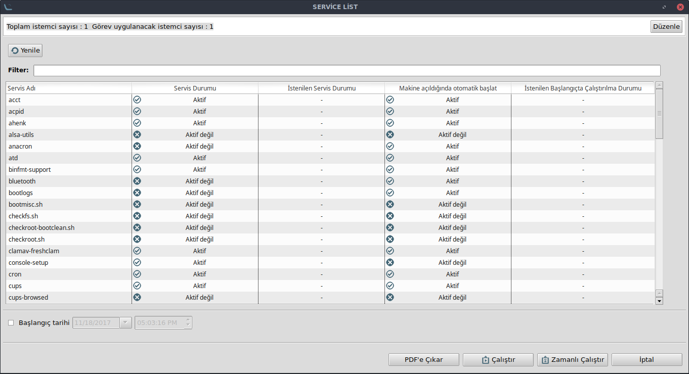

# Servis Eklentisi

Bir görev eklentisidir, kullanıcının Ahenk istemci/sunucu makinesinde var olan servisleri yönetmesini sağlamaktadır.

## Servis Yönetimi

Bu görevde, kullanıcı servis ad(lar)ını belirler. **Çalıştır** butonuna tıklandığında izlenen servislerin sonuçları ekranda listelenmeye başlar. **Servis İzleme Durumu** servisin izlenilebilirliğini gösterir. İlgili ahenk üzerinde servisin olup-olmaması veya servisin izlenmesine engel teşkil edecek bir sorun olması gibi durumlar bu ekrandan takip edilebilir.

**Servis Durumu** alanına anlık olarak servisin aktif-pasif bilgisi düşer. Bir servis için **Servisi Durdur/Başlat** alanına tıklanarak yeni servis durumu belirlenebilir. Ekranda listelenen tüm servislerin veya arama çubuğundan süzülen servislerin durumlarını değiştirmek için ise yukarıdaki **Tümünü Durdur**,**Tümünü Başlat** ve **"-"** butonları kullanılabilir. 

## Servis Listesi

Bir Ahenk için çalıştırılabilen bu görevde, Ahenk makinesinde var olan tüm servisler, adı, anlık durumu, makina açıldığında otomatik başlatılıp başlatılmadığı bilgisiyle bu ekranda listelenmektedir. Kullanıcı bir ya da daha çok servis için bu bilgileri istenilen durum kolonlarını güncellemesiyle değiştirebilmektedir.

