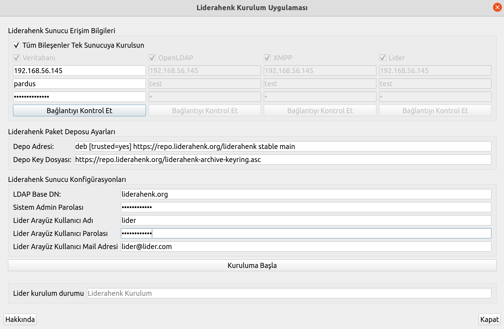

**What to Do During the Lider Server Installation Phase**

**NOTE :**  Follow the installation steps in order. 

**1)**  For setup application : Pardus-23.0-GNOME version  https://indir.pardus.org.tr/ISO/Pardus23/Pardus-23.1-GNOME-amd64.iso or Pardus-23.0-XFCE version https://indir.pardus.org.tr/ISO/Pardus23/Pardus-23.1-XFCE-amd64.iso can be installed.

**2)** You can download the Pardus-23.1-SERVER version for the Lider server from https://indir.pardus.org.tr/ISO/Pardus23/Pardus-23.1-SERVER-amd64.iso. Set the server language to English.

**3)** The next steps are the necessary steps to run the Lider Server Installation Application. ( Please run the commands below on the version of Pardus-23.0-GNOME or Pardus-23.0-XFCE that you installed in step **1**.)

**Installing Dependencies**


The following commands are typed in the terminal.

````
sudo apt-get install python3-paramiko python3-pyqt5 python3-pip python3-psutil xterm 
````

````
sudo rm /usr/lib/python3.11/EXTERNALLY-MANAGED
````

````
pip install mysql-connector-python argon2-cffi
````

**Downloading the Application**

To download the Leader Installation App;

````
sudo apt-get install git
````

 Git package is installed with the command.

````
git clone https://github.com/Pardus-LiderAhenk/lider-ahenk-installer.git
````

The Lider Installation Application is downloaded with the command.

**Running the Application**

To run the setup application;

````
cd lider-ahenk-installer/src/
````

With the command, go to the src directory and

````
python3 app.py
````

The installation application is run with the command.

**Note** : Before running the application, the ssh package must be installed on the machine where the Lider Ahenk installation application is running and on the machines to be installed.

**Lider Ahenk Server Access Information**

It is the area where the leader server components (Database, OpenLDAP, XMPP and Leader) will be installed on which server or servers are determined. If all components will be installed on a single server, the "**Install All Components on Single Server**" option is selected.
The image below shows the installation of components on a single server.



In case components are required to be installed on separate servers, the component to be installed is selected and access information is entered.
The image below shows the installation of components on individual servers.


After entering the server access information, the "**Check Connection**" button is clicked to check whether there is access to the server.

**Lider Repository Settings**

Installing the Lider components using which package repository is performed in this menu. The Main Package Repository is selected for stable Lider Ahenk packages, and the Test Package Repository for test Lider Ahenk packages.
Repository Key File: It refers to the key file created for the Lider Ahenk package repository.

**NOTE:** If the package repositories for the server to be installed are mirrored to the local (mirror), local addresses must be entered for the Repository Address and Repository Key File.
 
**Lider Server Configurations**

The following fields must be entered for Lider server configurations.


**LDAP Base DN:** LDAP base node,<br>
**System Admin Password:** Admin password for Liderahenk components,<br>
**Lider Interface Username:** Username to use the Lider Interface (Lider Admin or System Administrator), <br>
**Lider Interface User Password:** User password to use the Lider Interface, <br>
**Lider Interface User Email Address:** The e-mail address that the Lider interface user can use when she forgets his/her password.


 By clicking the **Start Installation** button, Liderahenk server installation is started.

After the installation is complete, go to the web browser.
By entering the address as below, access to the Lider Inferfaces is provided.

````
$lider_server_address:8080
````

<link href=/lider2.0/assets/style.css rel=stylesheet></link>
