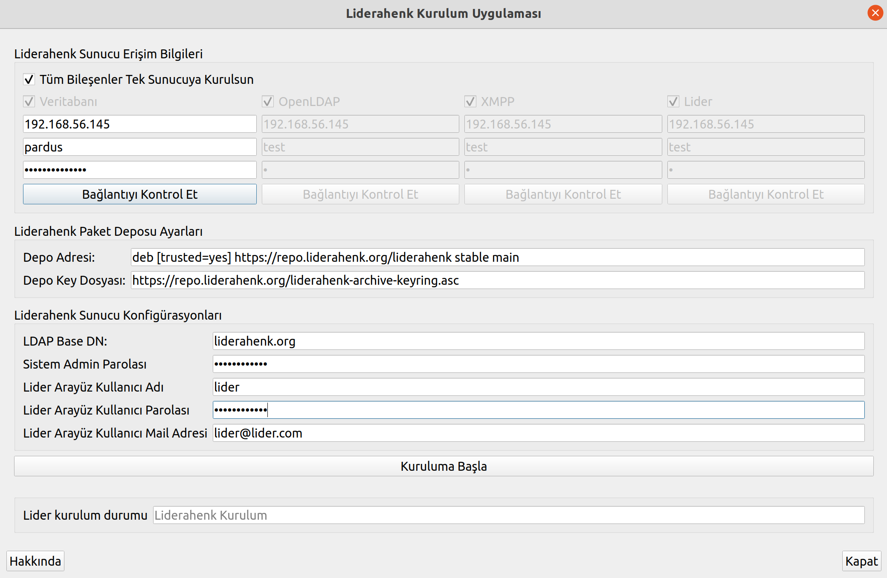

**Lider Sunucu Kurulum Aşamasında Yapılması Gerekenler**

**NOT :**  Kurulum adımlarını sıra ile uygulayınız. 

**1)**  Kurulum uygulaması için : Pardus-23.0-GNOME sürümü  https://indir.pardus.org.tr/ISO/Pardus23/Pardus-23.1-GNOME-amd64.iso veya Pardus-23.0-XFCE sürümü https://indir.pardus.org.tr/ISO/Pardus23/Pardus-23.1-XFCE-amd64.iso kurulur.

**2)** Lider sunucusu için Pardus-23.1-SERVER sürümünü https://indir.pardus.org.tr/ISO/Pardus23/Pardus-23.1-SERVER-amd64.iso adresinden indirebilirsiniz. Sunucu dilini ingilizce olarak ayarlayınız. 

**3)** Sıradaki adımlar Lider Sunucu Kurulum Uygulamasını çalıştırmak için gerekenli adımlardır. ( Lütfen aşağıda bulunan komutları **1** inci adımda kurmuş olduğumuz Pardus-23.0-GNOME veya Pardus-23.0-XFCE sürümü üzerinde çalıştırınız.)

**Bağımlılıkların Kurulması**


Uçbirimde aşağıdaki komutlar sırasıyla yazılır.

````
sudo apt-get install python3-paramiko python3-pyqt5 python3-pip python3-psutil xterm 
````

````
sudo rm /usr/lib/python3.11/EXTERNALLY-MANAGED
````

````
pip install mysql-connector-python argon2-cffi
````

**Uygulamanın İndirilmesi**

Lider Kurulum Uygulamasını indirmek için;

````
sudo apt-get install git
````

komutu ile git paketi yüklenir.

````
git clone https://github.com/Pardus-LiderAhenk/lider-ahenk-installer.git
````

Komutu ile Lider Kurulum Uygulaması indirilir.

**Uygulamanın Çalıştırılması**

Kurulum uygulamasını çalıştırmak için;

````
cd lider-ahenk-installer/src/
````

komutu ile src dizinine gidilir ve

````
python3 app.py
````

komutu ile kurulum uygulaması çalıştırılır.

**Not** : Uygulamayı çalıştırmadan önce lider ahenk kurulum uygulamasının çalıştırıldığı makinede ve  kurulum yapılacak makinelerde ssh paketi kurulu olmalıdır.

**Lider Ahenk Sunucu Erişim Bilgileri**

Lider sunucu bileşenlerinin (Veritabanı, OpenLDAP, XMPP ve Lider) hangi sunucu ya da sunuculara kurulucağının belirlendiği alandır. Tüm bileşenler tek sunucuya kurulacaksa "**Tüm Bileşenler Tek Sunucuya Kurulsun**" seçeneği seçilir. 
Aşağıdaki resimde bileşenlerin tek sunucuya kurulması durumu gösterilmiştir.



Bileşenlerin ayrı ayrı sunuculara kurulması istenildiği durumda hangi bileşen kurulcaksa o bileşen seçilir ve erişim bilgileri girilir.
Aşağıdaki resimde bileşenlerin ayrı ayrı sunuculara kurulması durumu gösterilmiştir.


Sunucu erişim bilgileri girildikten sonra "**Bağlantıyı Kontrol Et**" butonuna tıklanarak sunucuya erişim olup olmadığı kontrol edilir.

**Lider Deposu Ayarları**

Lider bileşenlerinin hangi paket deposu kullanılarak kurulması bu menüde gerçekleştirilir. Stable lider ahenk paketleri için Ana Paket Deposu, test lider ahenk paketleri için Test Paket Deposu seçilir.
Depo Key Dosyası: Lider Ahenk paket deposu için oluşturulan anahtar dosyasıyı ifade eder.

**NOT:** Kurulum yapılacak sunucu için paket depoları yerele aynalanmış ise(mirror) Depo Adresi ve Depo Key Dosyası için yerel adresler girilmelidir.
 
**Lider Sunucu Konfigürasyonları**

Lider sunucu konfigürasyonları için aşağıdaki alanların girilmesi gerekmektedir.


**LDAP Base DN:** LDAP temel düğümü,<br>
**Sistem Admin Parolası:** Liderahenk bileşenleri için admin yönetici parolası,<br>
**Lider Arayüz Kullanıcı Adı:** Lider arayüzü kullanacak kullanıcı adı (Lider Admini veya Sistem Yönetici), <br>
**Lider Arayüz Kullanıcı Parolası:** Lider arayüzü kullanacak kullanıcı parolası, <br>
**Lider Arayüz Kullanıcı Mail Adresi:** Lider arayüz kullanısının parolasını unuttuğunda kullanabileceği mail adresi.


**Kuruluma Başla** butonuna tıklanarak Liderahenk sunucu kurulumu başlatılır. 

Kurulum tamamlandıktan sonra internet taraycısına
aşağıdaki gibi adres girilerek Lider Arayüze giriş sağlanır.

````
$lider_server_address:8080
````


<link href=/lider2.0/assets/style.css rel=stylesheet></link>
