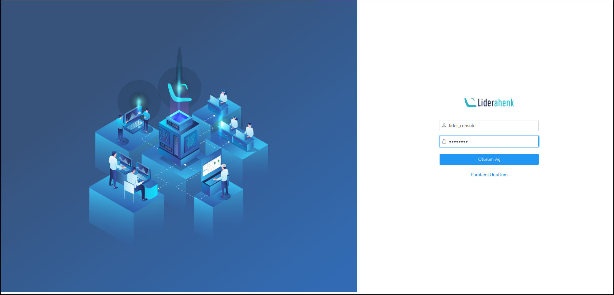
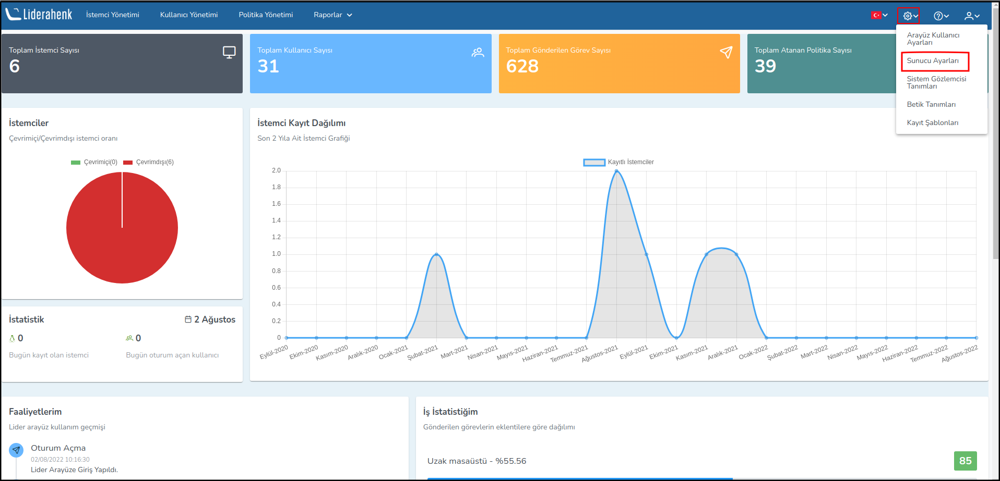
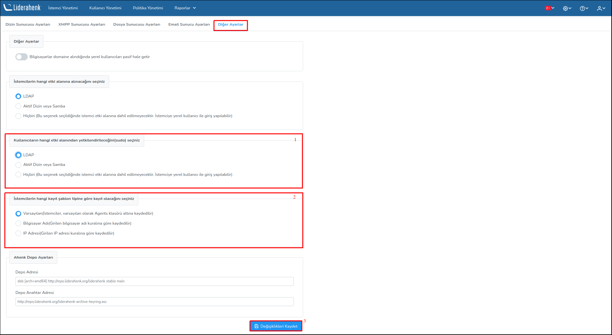

<link href=/lider3.0/assets/style.css rel=stylesheet></link>
**Lider v2 Sürümünden Lider v3 Sürümüne Güncelleme**

Lider v2 sunucusunda sırasıyla aşağıdaki komutlar çalıştırılır;

````
wget https://liderahenk.org/downloads/liderahenk_v2_to_v3.sh
````

````
chmod +x liderahenk_v2_to_v3.sh
````

Aşağıdaki komut çalıştırmadan önce parametre ($lider_server_ip_address) olarak Lider Sunucu IP adresi verilir.


````
sudo /bin/bash liderahenk_v2_to_v3.sh $lider_server_ip_address
````

Örn: ** sudo /bin/bash liderahenk_v2_to_v3.sh 192.168.x.x **

İnternet tarayıcısına ** $lider_server_ip_address:8080 ** yazılarak Liderahenk MYS uygulaması açılır ve aşağıdaki ayarlar sırasıyla uygulanır.

**1)** Lider Arayüz kullanıcı adı ve parolası girilerek Liderahenk MYS uygulamasını giriş yapılır.

[](./images/upgrade-1.png)


**2)** Ayarlar butonuna tıklanarak Sunucu Ayarları sayfası açılır.

[](./images/upgrade-2.png)

**3)** Diğer Ayarlar sekmesine tıklanarak ** Kullanıcıların hangi etki alanından yetkilendirileceğini(sudo) ** ile  ** İstemcilerin hangi kayıt şablon tipine göre kayıt olacağını ** ayarları Lider v2.0 sürümündeki yetkilendirme ve kayıt şablonu politikalarına göre seçilerek değişiklikler kaydedilir.

[](./images/upgrade-3.png)