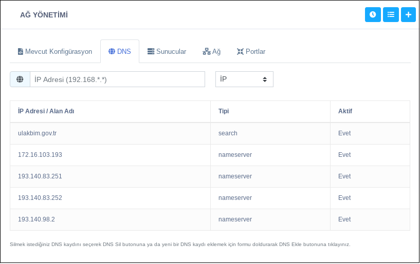

**Ağ Yönetimi**

Mevcut konfigürasyon bölümünde bilgisayarın adı değiştirilir.

DNS bölümünde silmek istediğiniz kaydı seçerek silebilir ya da yeni bir kayıt eklemek için formu doldurduktan sonra ekle butonuna basarak yeni DNS ekleyebilirsiniz.

Sunucular bölümünde istediğiniz sunucu(Host) kaydını seçerek sunucu silebilir ya da yeni bir sunucu(host) eklemek için formu doldurduktan sonra sunucu ekleyebilirsiniz.

Ağ bölümünde istediğiniz ağ ayarını seçerek ağ ayarını silebilir ya da yeni ağ ayarı eklemek için formu doldurduktan sonra yeni ağ ayarı ekleyebilirsiniz.

Portlar bölümünde istediğiniz portu seçerek engelleyebilir veya izin verebilirsiniz.

<link href=/lider2.0/assets/style.css rel=stylesheet></link>
