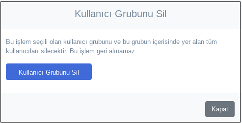

**Kullanıcı Grup Yönetimi**

Kullanıcı grup yönetimi kısmında, kullanıcı grupları düzenlenebilir, seçilen gruplara politika atanabilir, atanan 
politalar kaldırılabilir ve atanan politikalar gözlemlenebilir.

**Grup Üyeleri**

Grup üyeleri yönetimi sayesinde gruba kullanıcı ekleneiblir, grup adı düzenlenebilir, grup taşınabilir ve grup silinebilir.

Resimde gösterildiği seçilen kullanıcılar gruba eklenebilir.

Seçilen grubun adı düzenlenebilir.

Oluşturulan klasörler arasında grub istenilen yere taşınabilir.

Kullanıcı grubu istenildiği takdirde silinebilir.

**Aktif Politika Listesi**

Aktif Politika Listesi kısmında oluşturulan ve kaydedilen politikaların listesinin gözüktüğü kısımdır.

Politika atamak için aktif politika listesinden bir politika seçilir ve uygula butonuna tıklanır.

**Atanan Politikalar**

Atanan politika kısmında seçilen gruba atanan politikalar bu kısımda listelenir. Bu kısımda seçilen gruplara atanan 
politikalar kaldırılabilir.

<link href=/lider2.0/assets/style.css rel=stylesheet></link>
