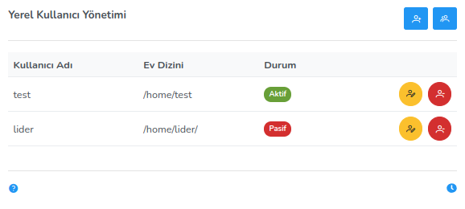

**Local User Management**

It has been developed to add new users to the system, delete the user and make changes to the existing user. On the add screen, there are fields for username, password, home directory, active/inactive status and user groups. The local user plugin has four different features: Listing, Adding Users, Deleting and Editing.

To add a new user, enter a username, password, and home directory that meet the username constraints.

It is specified that the user will be "Active" or "Passive" (In case of inactive, the user is not allowed to login.). The User Groups section is optional. The user can be added to more than one group or not to any group.<link href=/lider3.0/assets/style.css rel=stylesheet></link>
