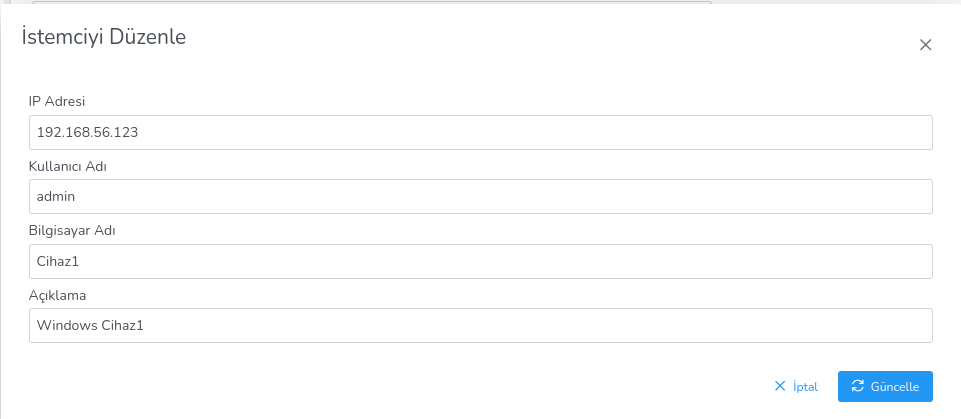

**Remote Access**

Remote access can be provided to the selected client by establishing a VNC, SSH and RDP connection.

Remote connection options are divided into 3;
 
**Connect via VNC**

- Enable user permission and notification

- Disable user permission and notification

It consists of 2 options.

The IP you want to connect to the selected client is selected from the upper right corner.

**Connect via SSH**

SSH connection is provided to the selected client by entering the IP address, username and password.

**Connect via RDP**

There are 2 tabs, Connection and Registered Clients.

Connection:

- Connection can be made by selecting from Registered Connections and entering only the password.

- If no selection is made, a connection to the client is made via RDP by entering the IP address, username and password.

Registered Clients:

- Registered clients can be viewed, edited and deleted from the table.

- New Clients can be added.

<link href=/lider3.0/assets/style.css rel=stylesheet></link>
