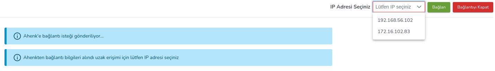

**Uzak Bağlantı**

Seçilen istemciye VNC ve SSH bağlantısı kurularak uzak erişim sağlanabilmektedir.

Uzak bağlantı seçenekleri 2 ye ayrılmaktadır ;
 
**VNC ile Bağlan**

-Kullanıcı izni ve bildirimleri aktif et,

-Kullanıcı izni ve bildirimleri yok

olmak üzere 2 seçenekten oluşmaktadır.

Seçilen istemciye bağlanmak istediğiniz IP seçimi sağ üst köşeden yapılır.

**SSH ile Bağlan**

IP adresi, kullanıcı adı ve parola girilerek seçilen istemciye SSH bağlantısı sağlanır.

<link href=/lider3.0/assets/style.css rel=stylesheet></link>
