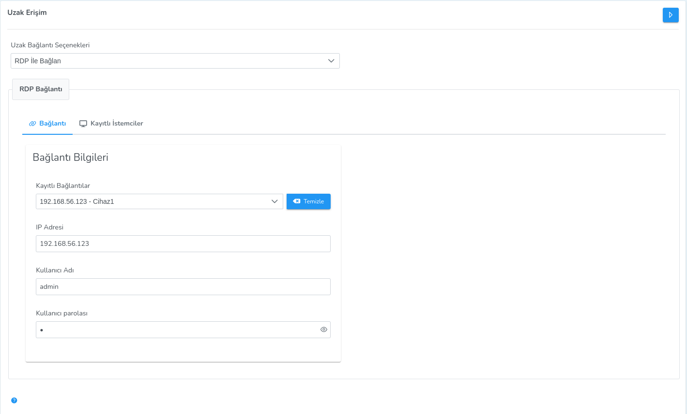
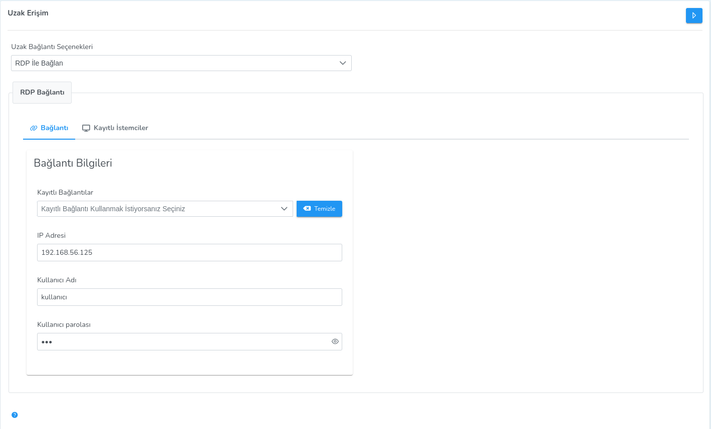
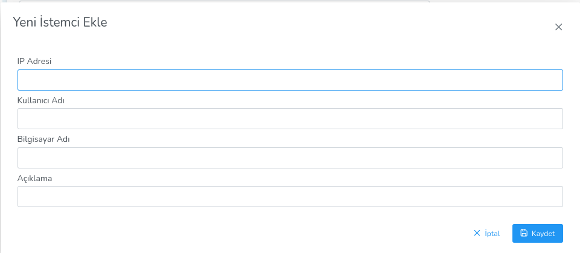

**Uzak Bağlantı**

Seçilen istemciye VNC, SSH ve RDP bağlantısı kurularak uzak erişim sağlanabilmektedir.

Uzak bağlantı seçenekleri 3 ye ayrılmaktadır ;
 
**VNC ile Bağlan**

- Kullanıcı izni ve bildirimleri aktif et,

- Kullanıcı izni ve bildirimleri yok

olmak üzere 2 seçenekten oluşmaktadır.

Seçilen istemciye bağlanmak istediğiniz IP seçimi sağ üst köşeden yapılır.

**SSH ile Bağlan**

IP adresi, kullanıcı adı ve parola girilerek seçilen istemciye SSH bağlantısı sağlanır.

**RDP ile Bağlan**

Bağlantı ve Kayıtlı İstemciler olmak üzere 2 sekme bulunur.

Bağlantı:

- Kayıtlı Bağlantılar'dan seçim yaparak sadece parola girerek bağlantı yapılabilir.

- Seçim yapılmazsa IP adresi, kullanıcı adı ve parola girilerek istemciye RDP ile bağlantı sağlanır.

Kayıtlı İstemciler:

- Kaydedilen istemciler tablodan görüntülenebilir, düzenlenebilir ve silinebilir.

- Yeni İstemci eklenebilir.

<link href=/lider3.0/assets/style.css rel=stylesheet></link>
