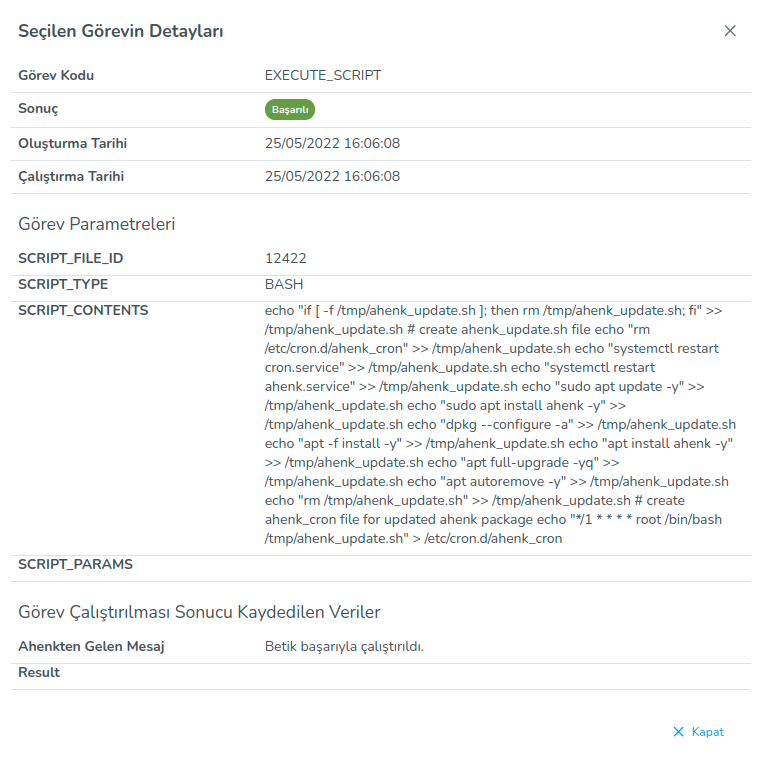

**Geçmiş**

Geçmiş eklentisi seçilen ahenk üzerinde çalıştırılan görevlerin geçmişini gösterir.

Seçilen görevin detayları : görev adı, çalıştırma sonucu, tarihi, gönderilen görevin parametrilerini gösterir.
 

<link href=/lider3.0/assets/style.css rel=stylesheet></link>
