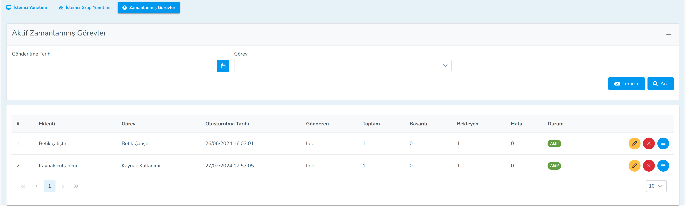
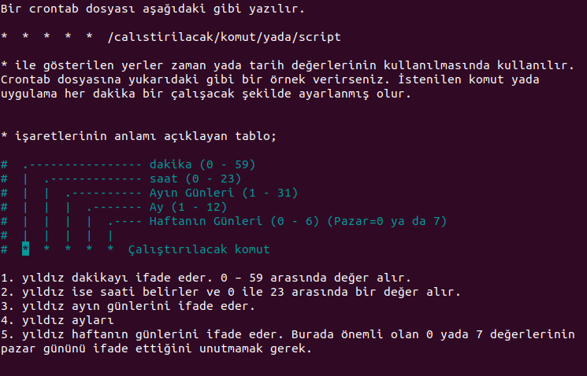
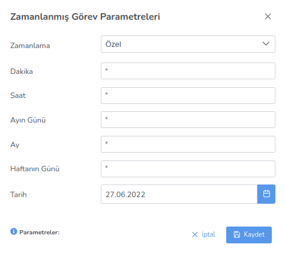

**Scheduled Task**

The Scheduled Tasks menu is the section where scheduled tasks for clients or client groups are managed. 
The user can apply the necessary filters from this menu, view the details of active scheduled tasks, and 
cancel scheduled tasks from this menu.

Crontab is a service used on linux systems. Crontab is where you specify a command, script or application.
allows it to work at certain time intervals.

Scheduled tasks on clients or client groups with tasks in the Lider
You can also run it by sending

<link href=/lider3.0/assets/style.css rel=stylesheet></link>
