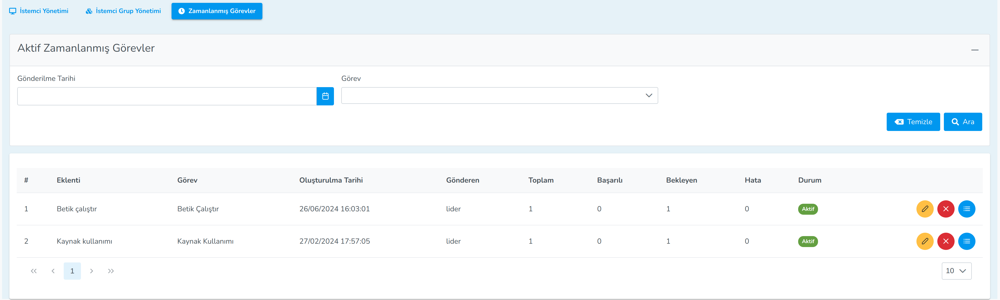

**Zamanlanmış Görev**

Zamanlanmış Görev menüsünde istemci veya istemci grupları için yer alan zamanlanmış görevlerin yönetildiği kısımdır.
Kullanıcı bu menüden gerekli giltrelemeyi yapabilir. Aktif zamanlanmış görevin detaylarına bakabilir. Zamanlanmış 
görevler bu menüden iptal edilebilir.

Crontab linux sistemlerinde kullanılan bir servistir. Crontab bir komutu, scripti ya da uygulamayı belirlediğiniz 
zaman veya belirli zaman aralıklarıyla çalışmasını sağlamaktadır.

Lider de bulunan görevleri istemciler yada istemci grupları üzerinde zamanlanmış görev 
göndererek de çalıştırabilirisiniz.

<link href=/lider3.0/assets/style.css rel=stylesheet></link>
