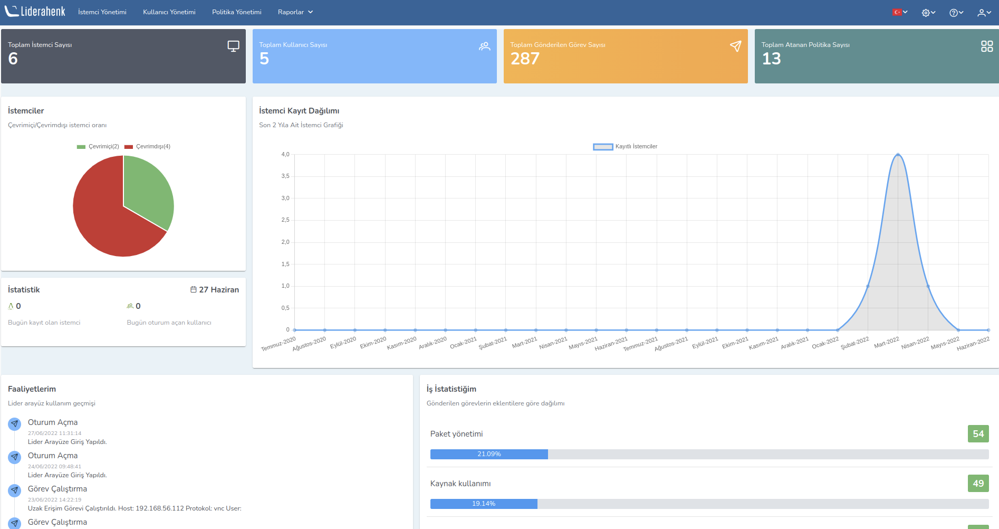

**Liderahenk 3.0**

###### Liderahenk Merkezi Yönetim Sistemi ######

Kurumsal ağ üzerindeki sistemleri ve kullanıcıları merkezden yönetilebilmeyi, izlemeyi ve denetlemeyi sağlayan,
açık kaynak kodlu bir yazılım sistemidir.

Resimde Liderahenk uygulamasının açılış sayfasıdır. Bu sayfada giriş yapan kullanıcılara sistemle alakalı genel bilgi
verilmektedir. Toplam istemci sayısı, toplam kullanıcı sayısı, toplam gönderilen görev sayısı ve toplam atanan politika 
sayısı gösterilmektedir. Bunun yanı sıra  anlık çevrimiçi ve çevrimdışı istemcilerin sayısı, istemci kayıt dağılım grafiği
gibi bilgilerde gözlemlenebilir.

<link href=/lider3.0/assets/style.css rel=stylesheet></link>
