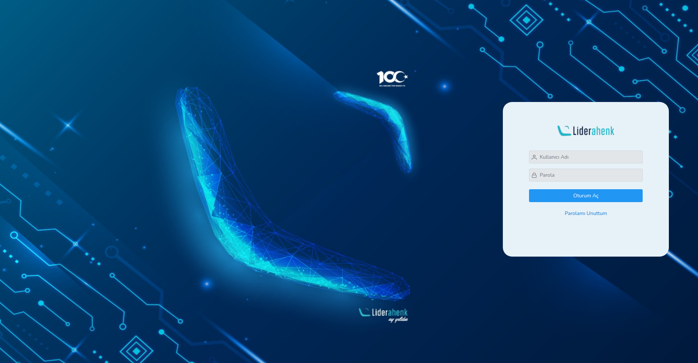

**LOGIN**

To open Liderahenk MYS application, " :8080 " port is added to the end of Lider Server IP.

In order to log in to Liderahenk cms application, an authorized user name and password must be entered.

<link href=/lider3.0/assets/style.css rel=stylesheet></link>
