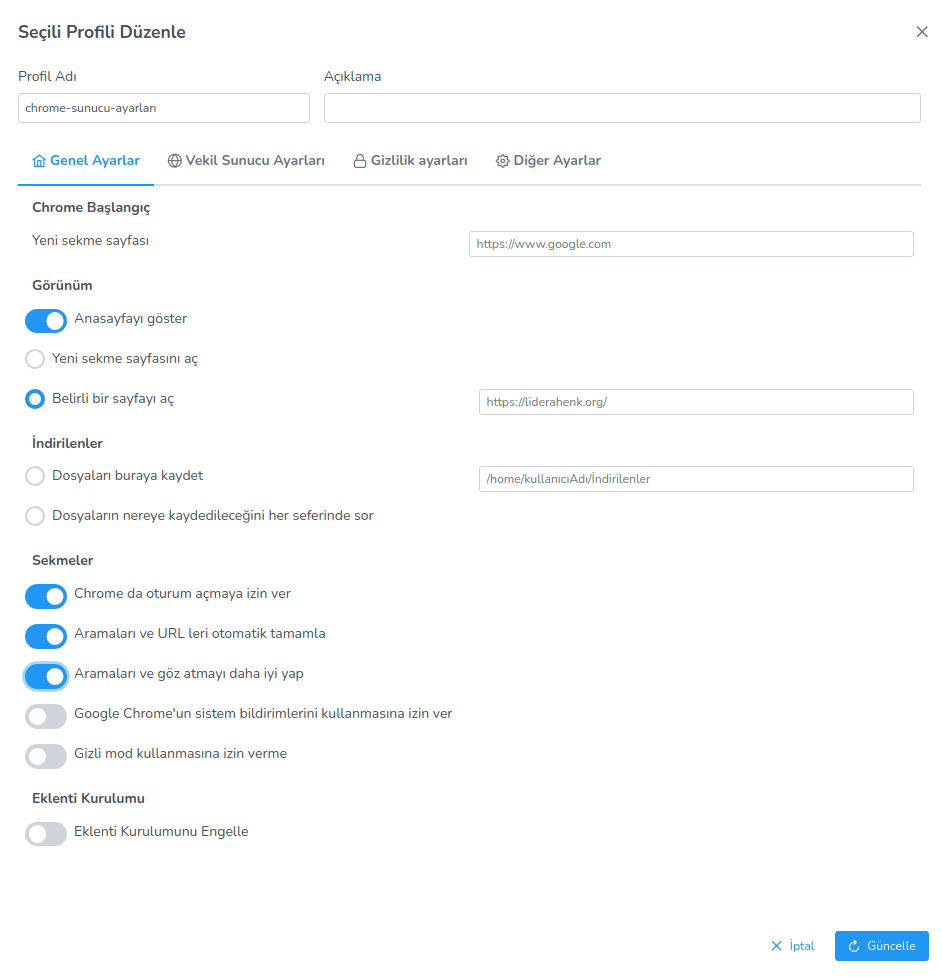

**Chrome Browser Settings**

In the Chrome browser settings, you can set Chrome startup, cookies management, plug-in installation, proxy server settings, and privacy settings.
The other settings option allows you to enter the desired setting in your chrome browser. You can configure the desired setting by entering it as a key-value. 

<link href=/lider3.0/assets/style.css rel=stylesheet></link>