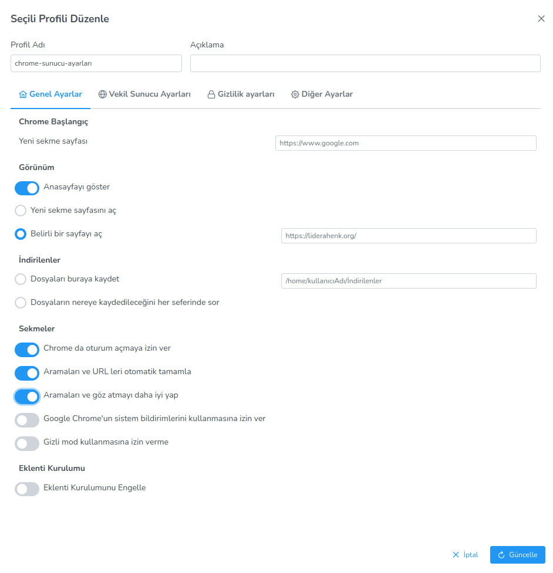
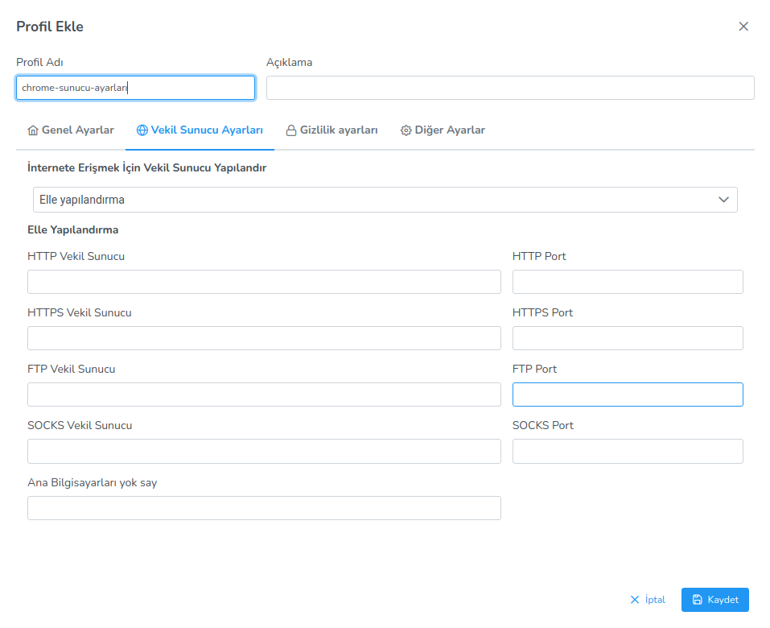

**Chrome Tarayıcı Ayarları**

Chrome tarayıcı ayarlarında, Chrome başlangıç, çerezlerin yönetimi, eklenti kurulumu, vekil sunucu ayarları ve gizlilik ayarları yapabilirsiniz.
Diğer ayarlar seçeneği ise chrome tarayıcınıza istediğiniz ayarı girmenizi sağlar. İstediğiniz ayarı anahtar-değer olarak girerek konfigüre edebilirsiniz.

<link href=/lider3.0/assets/style.css rel=stylesheet></link>