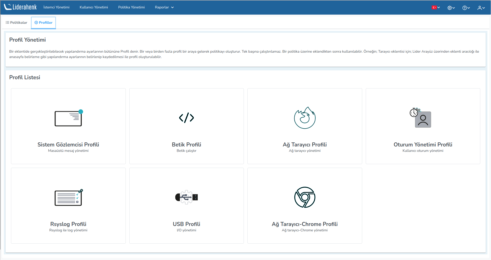

**Profiles**

The set of configuration settings that can be performed in a plugin is called a Profile. One or more profiles
come together to form policy. It cannot be operated alone. It can be used after it has been added to a policy.
For example; For the browser plugin; Configuration such as determining the homepage via the plugin via the Lider Interface
A profile can be created by specifying and saving the settings.

<link href=/lider3.0/assets/style.css rel=stylesheet></link>
