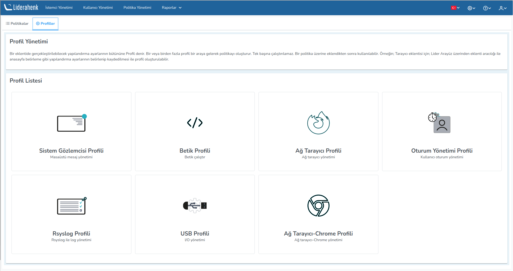

**Profiller**

Bir eklentide gerçekleştirilebilecek yapılandırma ayarlarının bütününe Profil denir. Bir veya birden fazla profil bir 
araya gelerek politikayı oluşturur. Tek başına çalıştırılamaz. Bir politika üzerine eklendikten sonra kullanılabilir. 
Örneğin; Tarayıcı eklentisi için; Lider Arayüz üzerinden eklenti aracılığı ile anasayfa belirleme gibi yapılandırma 
ayarlarının belirlenip kaydedilmesi ile profil oluşturulabilir.

<link href=/lider3.0/assets/style.css rel=stylesheet></link>
