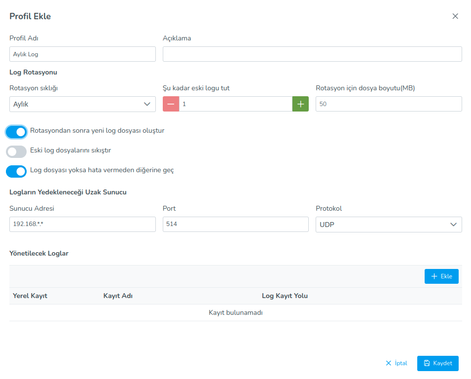

**Rsyslog Settings**

Rsyslog plugin is a profile plugin and assists in providing rotation configuration of log files in Ahenk machine.

In the profile, the rotation frequency of the user log files (daily, weekly, monthly, yearly), how old the log will be kept.
can determine the amount of file size (MB) required for rotation of the log file. Also to the user
related to log files; create new log file after rotation, compress old log files, log file
If not, options such as skip without error are also offered.

The user wants to rotate the log files to the table, where to rotate and whether locally or remotely.
It can provide the configuration by adding the information about whether it will be backed up to the machine. which will be backed up to the remote server
For log files, remote server address, port and protocol information should also be entered.

<link href=/lider3.0/assets/style.css rel=stylesheet></link>
