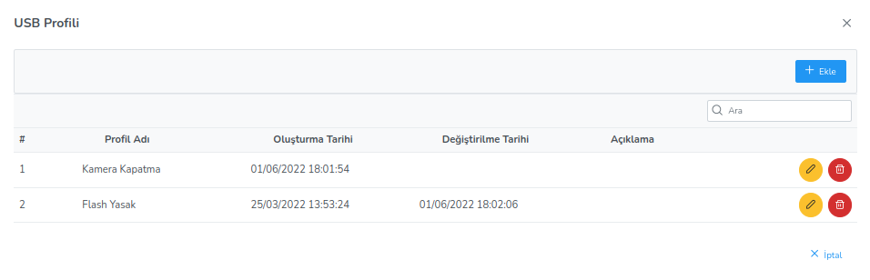

**USB Erişim Ayarları**

USB modülleri ve aygıtları üzerindeki izinleri düzenler.İlgili Ahenk makinesi üzerinde web kamerası, yazıcı, USB bellek 
ve fare-klavye izinlerini düzenler. İzin verme seçeneğinin seçilmesi sonucunda kullanıcı izin verilmeyen usb modülünü 
kullanamaz. İzin ver ya da verme seçeneklerinden hiçbirinin seçilmemesi durumunda ilgili usb elemanına izin verilmeyecektir. 
Bu nedenle izin için mutlaka “İzin ver” seçeneğinin seçilmiş olması gereklidir.

Bu politika da ek olarak beyazliste ve karaliste bulunmaktadır. Beyazlisteye eklenen USB aygıtlarına her koşulda izin 
verilirken karalisteye eklenen aygıtlara ise hiçbir şekilde izin verilmemektedir.

Bunu sağlamak için istenen listeye istenilen aygıtın üretici firması, modeli ve seri numarası girilir. Herhangi bir aygıt 
seçilip “Ekle” butonuna basılmasıyla liste üzerinde ekleme yapılır. Yine aynı şekilde “Sil” butonuna basılmasıyla seçilen 
kayıt silinir.

<link href=/lider3.0/assets/style.css rel=stylesheet></link>
