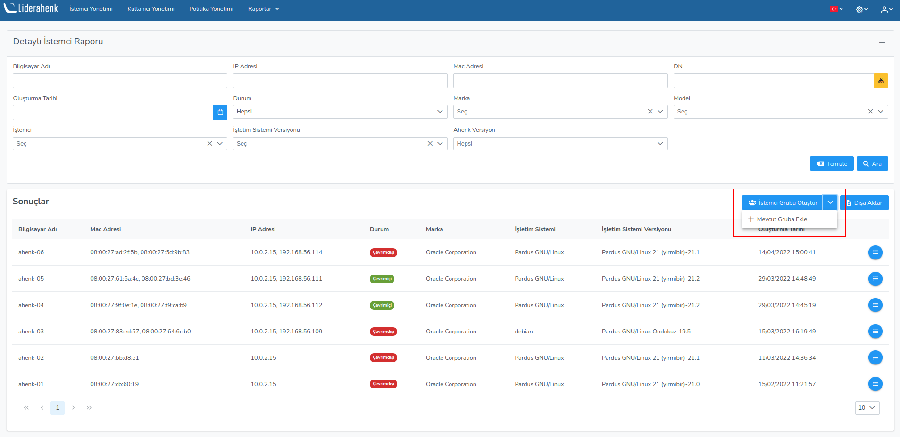

**Detaylı İşlemci Raporu**

Raporlar kısmında istemcilerin detaylı raporları ve bilgileri verilir. İstemcilerin : 
Bilgisayar Adı,	MAC Adresi, IP Adresi, DN, Durum, Faz	Marka, İşletim Sistemi,	Versiyon, Ahenk versiyonu
ve Oluşturulma Tarihi bilgileri gözlemlenir.

Dışa Aktar butonu  istemcilerin bütün bilgileri Excel formatında dışa aktarılır.

Bilgisayar Adı,	MAC Adresi, IP Adresi, DN, Durum, Marka, Model, İşletim Sistemi, İşlemci, Versiyon, 
Ahenk versiyonu ve Oluşturulma Tarihi ile istemciler filtrelebilir.

Seçilen istemci ile alakalı detaylı bilgi almak için ilgili butona tıklayarak görev detayları gözlemlenebilir.

Seçilen kullanıcılar daha önceden oluşturulmuş bir gruba dahil edilebilir veya seçilen bu kullanıcılar 
ile yeni bir grup oluşturulabilir.

Mevcut gruba ekle seçeniği ile açılan pencereden daha önceden oluşturulmuş kullanıcı gruplarından 
birine eklenebilir.

Yeni istemci grup oluştur seçeneği ile açılana pencereden yeni istemci grubu oluşturulur.

<link href=/lider3.0/assets/style.css rel=stylesheet></link>
