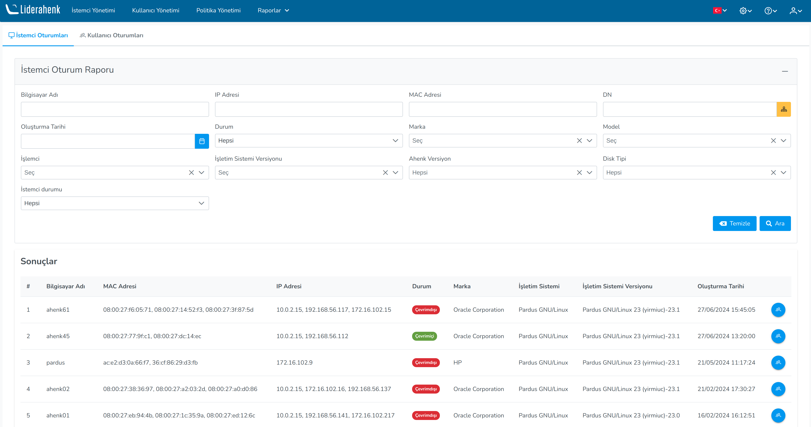

**Client Report**

On the Client Sessions page, the users logged in on the clients are displayed, and the 
clients are filtered by: Computer Name, MAC Address, IP Address, DN, Status, Phase, Brand, 
Operating System, Version, Ahenk version, and Creation Date. By clicking the details button, 
users who have logged in and logged out on the client can be observed.

