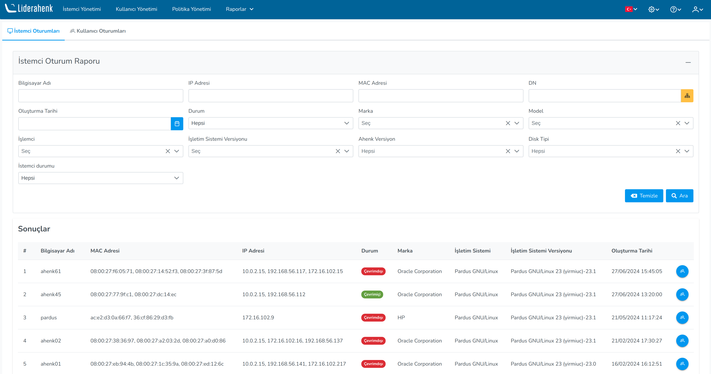

**İstemci Oturumları**

İstemci Oturumları sayfasında istemcilerin üzerinde oturum açan kullanıcıların gösterildiği ve 
istemcilerin : Bilgisayar Adı,	MAC Adresi, IP Adresi, DN, Durum, Faz, Marka, İşletim Sistemi,	
Versiyon, Ahenk versiyonu ve Oluşturulma Tarihi bilgileri ile istemciler filtrelenir. Detay butonuna
tıklanarak istemci üzerinde oturum açan ve oturum kapatan kullanıclar gözlemlenir.

