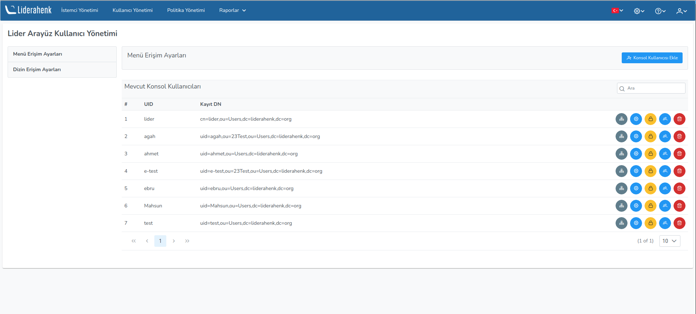
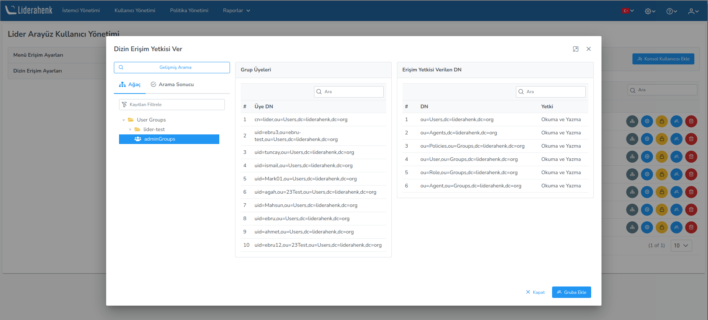
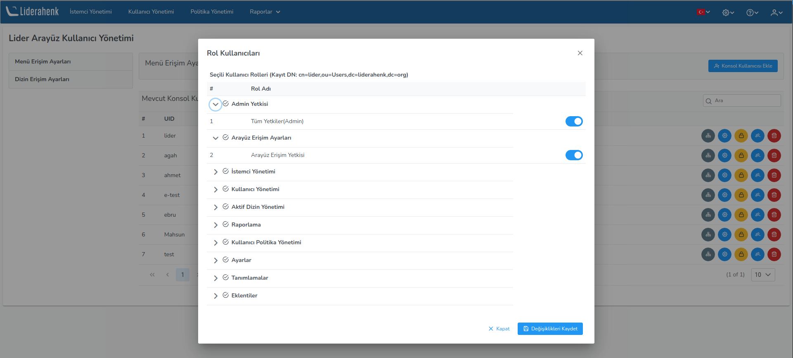
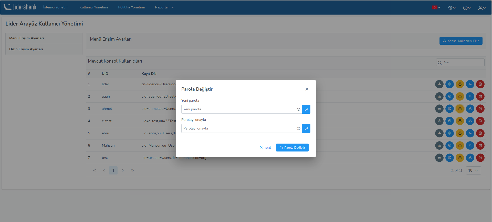
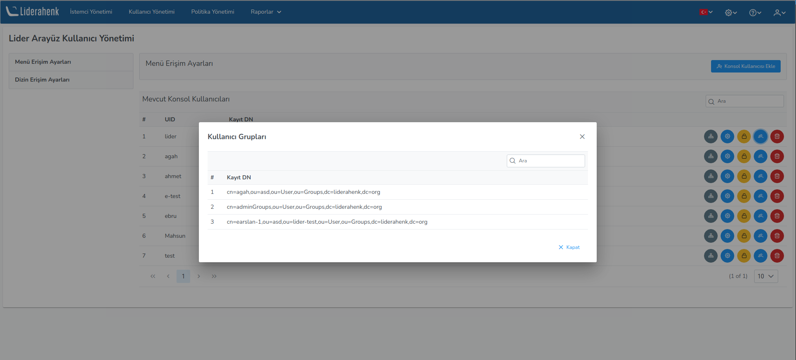
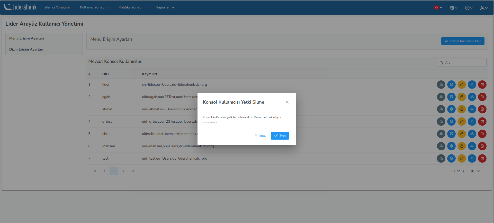
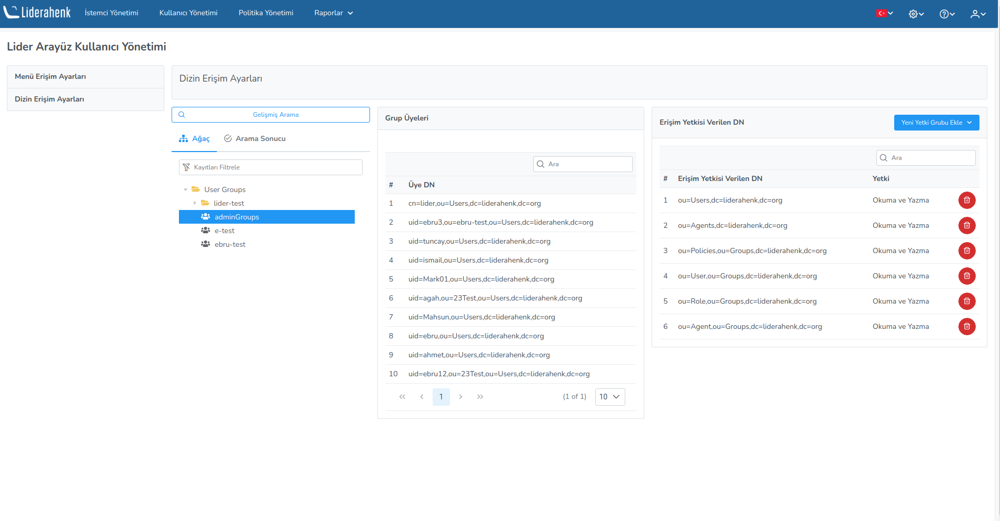

**Menu Access Settings**

Liderahenk menu access settings are made on this page. Directory and menu authorization is done by defining a new console user on this page.
You can view the groups to which the user has been added, delete them, and change their password.

You can add the user to the group you want by pressing the **Edit Directory Settings** button next to the user. 

You can assign the user the roles you want by pressing the **Edit Menu Settings** button next to the user.

You can change the user's password by pressing the **Change Password** button next to the user.

You can see the groups the user is in by pressing the **User Groups** button next to the user.

You can delete the user is permissions by pressing the **Delete** button next to the user.

**Directory Access Settings**

It contains the settings at which nodes on the LDAP tree the users who are authorized to use the interface. . For example: "adminGroups" user group to be able to authorize only ou=Agents,dc=liderahenk,dc=org and ou=Agent,ou=Groups,dc=leadership,dc=org
nodes, relevant nodes are selected from the menus on the add new authorization group button.

<link href=/lider3.0/assets/style.css rel=stylesheet></link>
