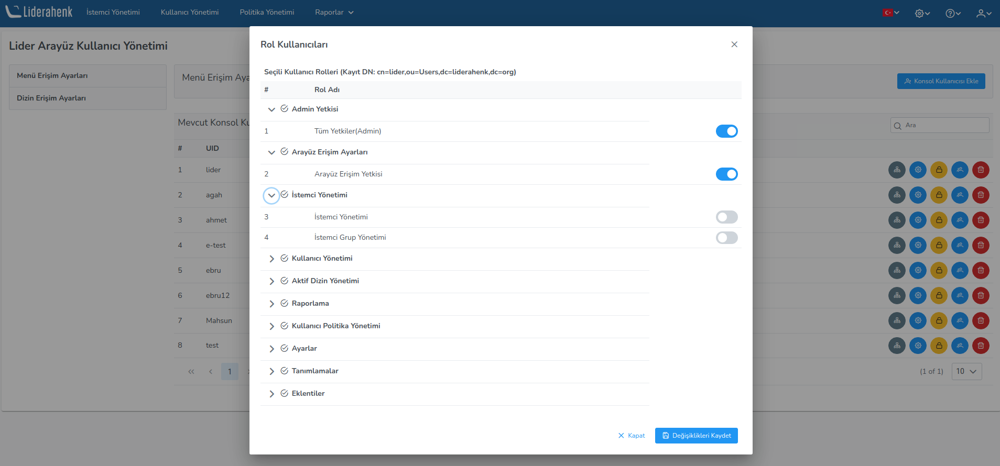

**Interface Access Settings**

**Interface User Management**

Liderahenk interface user authorization is done on this page. Menu authorization is done by giving roles to users on this page.
For example: When requested, granting only client management menu authorization, "Console Authority (Console Interaction Authority) and Client Management" roles are defined.

**Interface Users and Access Settings**

It contains the settings at which nodes on the LDAP tree the users who are authorized to use the interface.
. For example: "adminGroups" user group to be able to authorize only **ou=Agents,dc=liderahenk,dc=org**
and **ou=Agent,ou=Groups,dc=leadership,dc=org**  
nodes, relevant nodes are selected from the menus on the add new authorization group button.

<link href=/lider3.0/assets/style.css rel=stylesheet></link>
