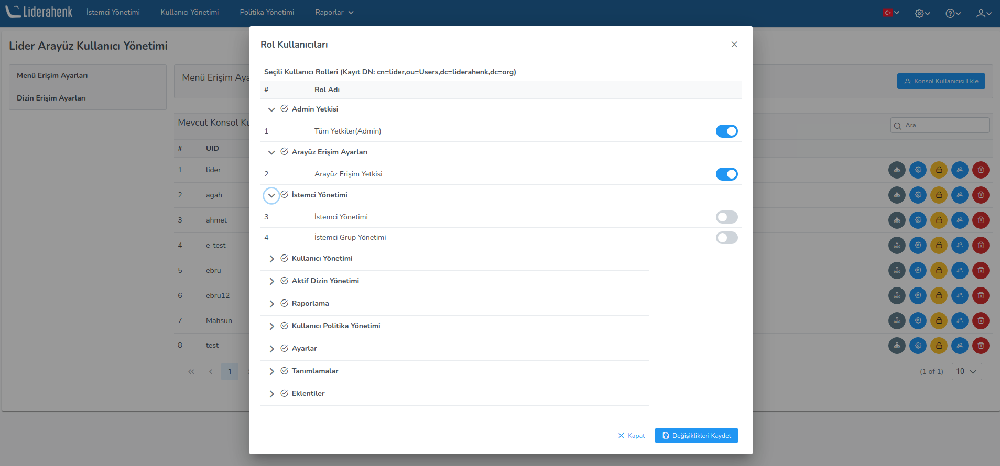

**Arayüz Erişim Ayarları**

**Arayüz Kullanıcı Yönetimi**

Liderahenk arayüz kullanıcı yetkilendirmesi bu sayfada yapılır. Bu sayfada kullanıcılara roller
tanımlanarak menü yetkilendirmesi yapılır. Örneğin : Sadece istemci yönetimi menü yetkisi verilmek 
istenildiğinde "Konsol Yetkisi(Konsol Etişim Yetkisi) ve İstemci Yönetimi" rolleri tanımlanır.

**Arayüz Kullanıcıları ve Erişim Ayarları**

Arayüz kullanım yetkisi verilen kullanıcıların LDAP ağacı üzerinde hangi düğümlerde yetkili olacağını
belirleyen ayarları içerir. Örneğin : "adminGroups" kullanıcı grubunun sadece **ou=Agents,dc=liderahenk,dc=org**
ve **ou=Agent,ou=Groups,dc=liderahenk,dc=org**	düğümlerinde yetkilendirebilmek için yeni yetki grubu
ekle butonundaki menülerden ilgili düğümler seçilir.

<link href=/lider3.0/assets/style.css rel=stylesheet></link>
