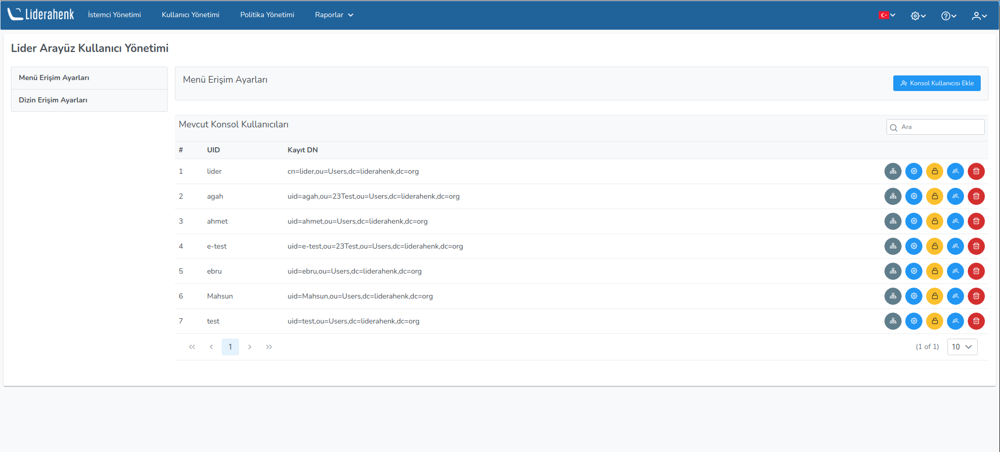
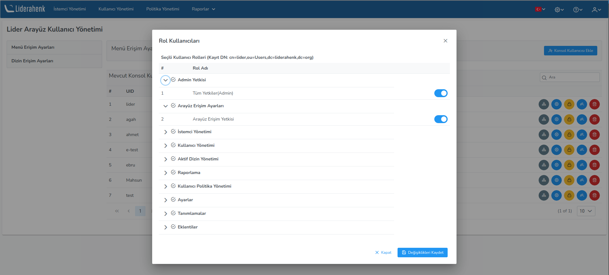
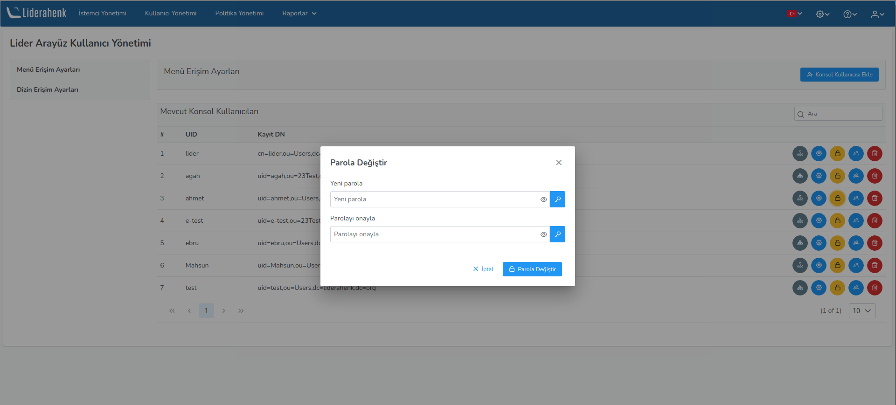
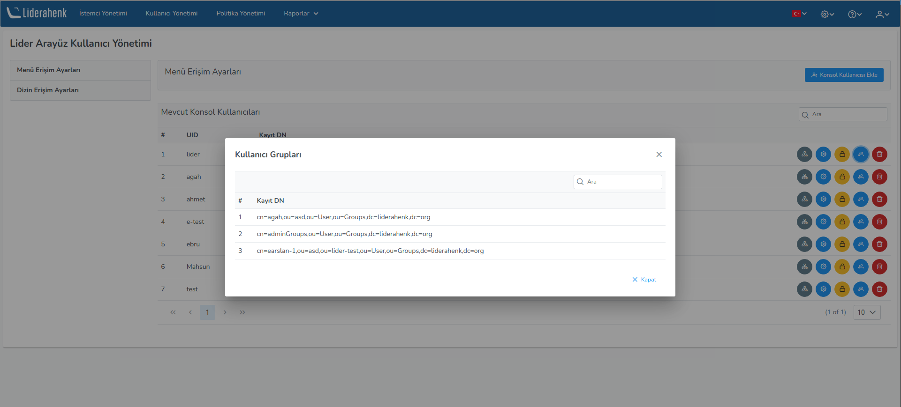
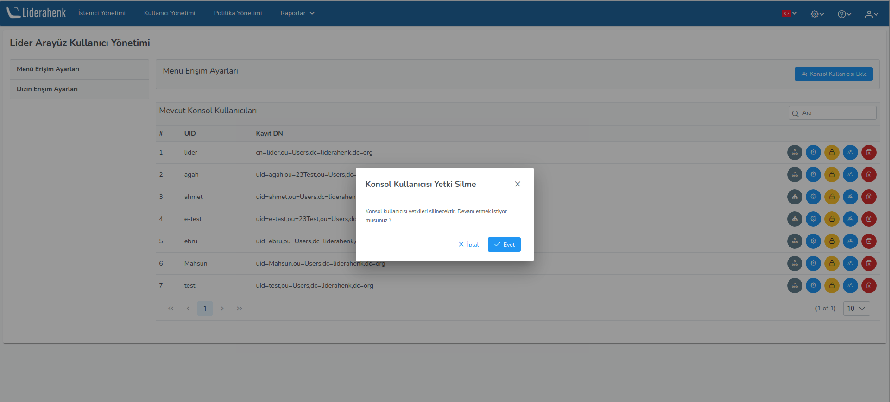
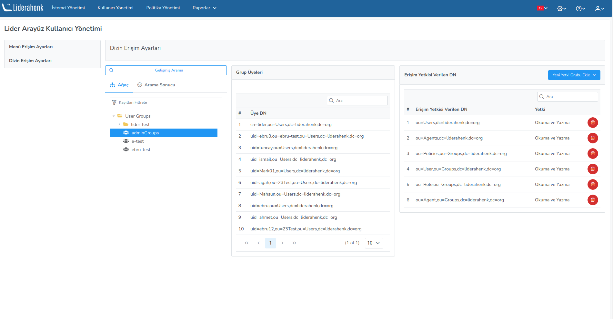

**Menü Erişim Ayarları**

Liderahenk menü erişim ayarları bu sayfada yapılır. Bu sayfa üzerinde yeni bir konsol kullanıcısı tanımlayarak dizin ve menü yetkilendirmesi yapılır.
Kullanıcının eklendiği gruplarını görüntüleyebilir, silebilir ve parolasını değiştirebilirsiniz.

Kullanıcının yanında yer alan **Dizin Ayarları Düzenle** butonuna basarak kullanıcıyı istediğiniz gruba ekleyebilirsiniz. 

Kullanıcının yanında yer alan **Menü Ayarları Düzenle** butonuna basarak kullanıcıyı istediğiniz rolleri atayabilirsiniz. 

Kullanıcının yanında yer alan **Parola Değiştir** butonuna basarak kullanıcının parolasını değiştirebilirsiniz..

Kullanıcının yanında yer alan **Kullanıcı Grupları** butonuna basarak kullanıcının yer aldığı grupları görebilirsiniz.

Kullanıcının yanında yer alan **Sil** butonuna basarak kullanıcının yetkilerini silebilirsiniz.

**Dizin Erişim Ayarları**

Menü erişim yetkisi verilen kullanıcıların LDAP ağacı üzerinde hangi düğümlerde yetkili olacağını
belirleyen ayarları içerir. Örneğin : "adminGroups" kullanıcı grubunun sadece **ou=Agents,dc=liderahenk,dc=org**
ve **ou=Agent,ou=Groups,dc=liderahenk,dc=org**	düğümlerinde yetkilendirebilmek için yeni yetki grubu
ekle butonundaki menülerden ilgili düğümler seçilir.

<link href=/lider3.0/assets/style.css rel=stylesheet></link>
