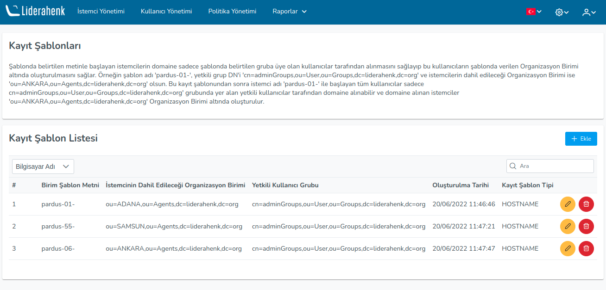
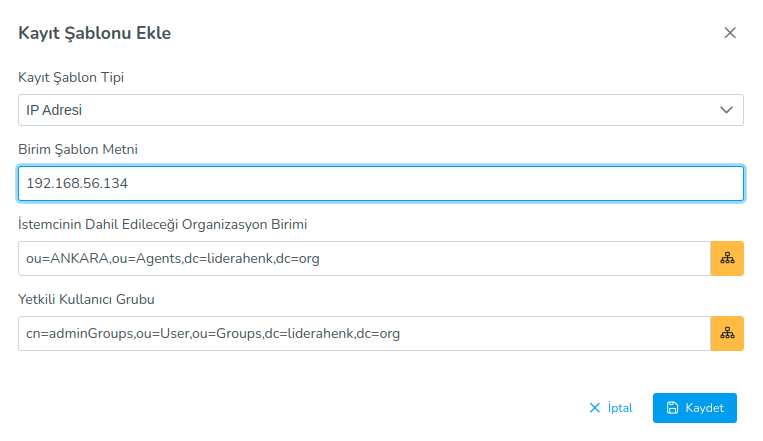
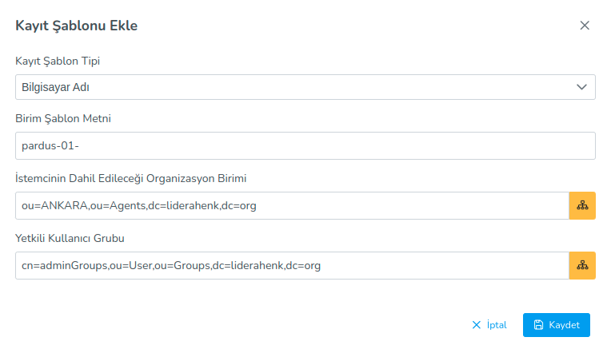

**Registration Templates**

Clients that start with the text specified in the template can only join the domain that is a member of the group specified in the template.
to be received by the users and have these users under the Organization Unit given in the template.
allows to be created. For example template name:

>'pardus-01-'

authorized group DN

>'cn=adminGroups,ou=User,ou=Groups,dc=liderahenk,dc=org'

and the Organizational Unit which the clients will be included is:

>'ou=ANKARA,ou=Agents,dc=liderahenk,dc=org'

Client name of all users starting with 'pardus-01-' only after this registration template:

>'cn=adminGroups,ou=User,ou=Groups,dc=liderahenk,dc=org'

It can be taken to the domain by authorized users in the group, and the clients taken to the domain

>'ou=ANKARA,ou=Agents,dc=liderahenk,dc=org'

It is created under the Organizational Unit.

Two types of registration templates can be created.

1) IP Address

In order to include the clients that receive IP with the specified IP Address, in the correct directory and the correct authorization group when logging into the domain.
It is the method which the IP Address is used.

2) Computer Name

In order to include the clients starting with the specified text in the correct directory and the correct authorization group when logging into the domain
The method by which the Computer Name is used.

<link href=/lider3.0/assets/style.css rel=stylesheet></link>
