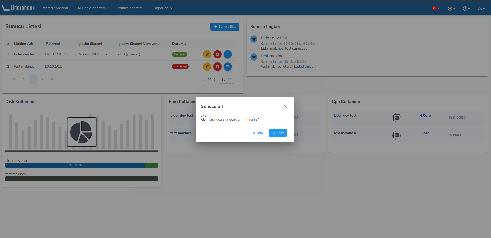

**Server Informations**

You can see the information of the servers by adding your servers in the server information section. In order to get information about the servers, the servers' SSH connections must be open and Osquery must be installed on them.

You can see the information about the machines you added as follows. On the listing page; It contains the IP address, operating system information, machine status, and machine details. User logs include the machine name, uptime, and your description. Disk, ram and cpu information of the machine is also included.

**Osquery Kurulum:**
Osquery is an open source system administration tool. With Osquery, you can collect information about your computer using the SQL-based query language.

If the osquery package is not available on your operating system, you need to download and install the osquery package;

- wget https://pkg.osquery.io/deb/osquery_4.6.0-1.linux_amd64.deb
- sudo dpkg -i osquery_4.6.0-1.linux_amd64.deb

If you have the Osquery package on your computer;

- sudo apt update
- sudo apt install osquery

This is how Osquery is installed for Debian-based operating systems.

When the ssh connection and Osquery are installed on the added machine, the details section is as follows.

You can delete and update the machines you have added.

