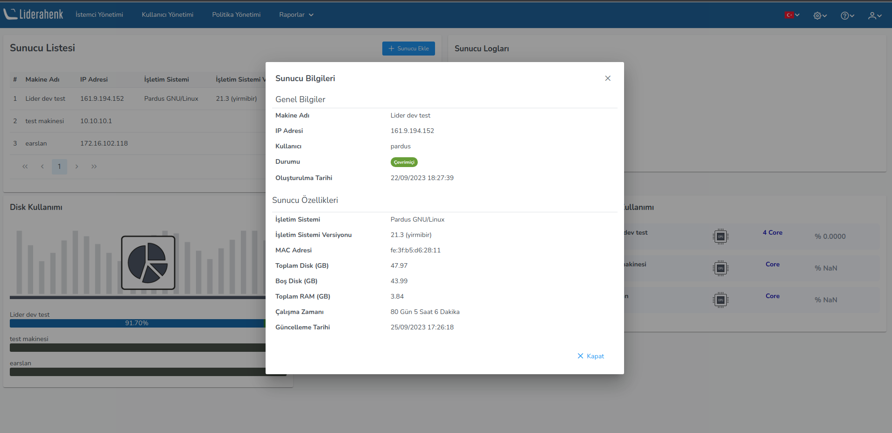
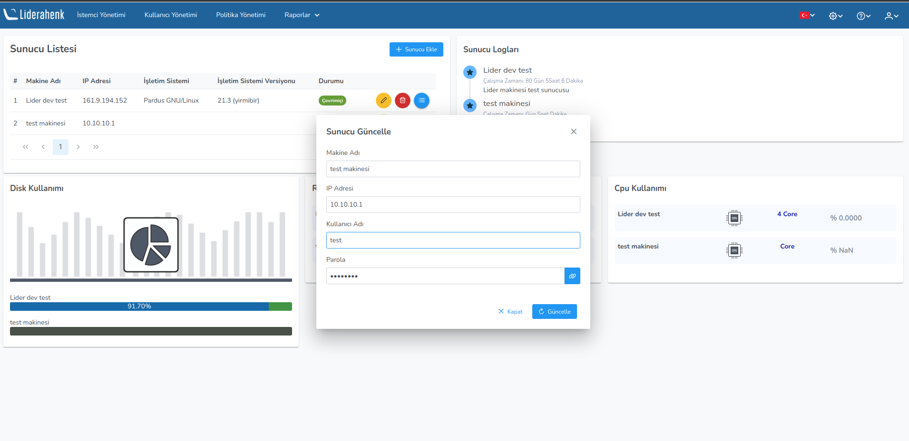

**Sunucu Bilgileri**

Liderahenk uygulaması üzerinde Ayarlar->Sunucu Bilgileri kısmına gelerek  Sunucu ekle butonuna basarak sunucularınızı ekleyebilirsiniz.

Eklediğimiz Sunuculara ait bilgileri aşağıdaki gibi görebilirsiniz. Sunuculara ait
listeleme ekranında; ip adresi, işletim sistemi bilgisi, makinenin durumu ve sunucunuza ait detayları görebilirsiniz. Kullanıcı loglarında ise makinenin ismi, uptime süresi ve açıklamanız yer almaktadır.

