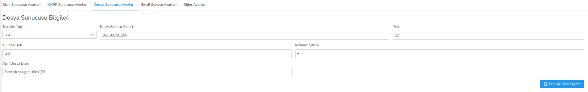

**Dosya Sunucu Ayarları**

Dosya sunucu bilgilerinin tutulduğu alandır.Bu alan transfer tipi, dosya sunucu adresi, port, kullanıcı 
adı ve kullanıcı şifresi değiştirilebilir.

Düzenle butonuna tıklanarak istenilen bilgiler değiştirilir ve Değişiklikleri Kaydet butonuna 
tıklayarak ayarlar kaydedilir.<link href=/lider3.0/assets/style.css rel=stylesheet></link>
