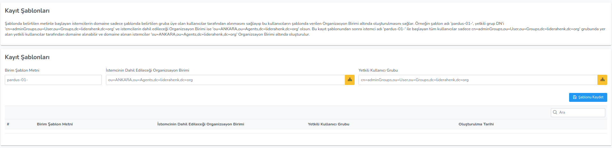

**Kayıt Şablonları**

Şablonda belirtilen metinle başlayan istemcilerin domaine sadece şablonda belirtilen gruba üye olan 
kullanıcılar tarafından alınmasını sağlayıp bu kullanıcıların şablonda verilen Organizasyon Birimi altında 
oluşturulmasını sağlar. Örneğin şablon adı 'pardus-01-', yetkili grup DN'i 
'cn=adminGroups,ou=User,ou=Groups,dc=liderahenk,dc=org' ve istemcilerin dahil edileceği Organizsayon 
Birimi ise 'ou=ANKARA,ou=Agents,dc=liderahenk,dc=org' olsun. Bu kayıt şablonundan sonra istemci adı 
'pardus-01-' ile başlayan tüm kullanıcılar sadece cn=adminGroups,ou=User,ou=Groups,dc=liderahenk,dc=org' 
grubunda yer alan yetkili kullanıcılar tarafından domaine alınabilir ve domaine alınan istemciler 
'ou=ANKARA,ou=Agents,dc=liderahenk,dc=org' Organizsayon Birimi altında oluşturulur.

