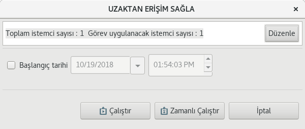
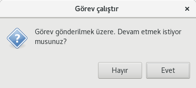

# Uzaktan Erişim Eklentisi

VNC yapısını kullanarak herhangi bir ağ sunucusu üzerinde çalışan grafik arayüz uygulamalarına başka bir bilgisayardan kolaylıkla ve hızla erişerek bu uygulamaların kullanılabilmesini ve yönetilebilmesini sağlar.

Uzaktan Erişim, bir görev eklentisidir. Uzaktan erişim yapılmak istenen Ahenk makinesi üzerinden görev ekranı açılır ve **“Çalıştır”** butonuna basılır. 

Gönderilme onayı verilir;

  Ahenk makinesi üzerinde aşağıdaki uyarı ekranıyla karşılaşılır.

Belirtilen ip’ye makinenin Ahenk bilgisayarında bulunan VNC sunucusuna bağlanmak istediği söylenir ve Ahenk kullanıcısına bu bağlantıya izin verip vermediği sorulur. Ahenk kullanıcısının bu bağlantıya izin vermesi durumunda(**Yes**) VNC sunucusuna bağlantı gerçekleşir ve ahenk üzerinde tüm yetkilere sahip olur.
**View** seçeneği tıklanırsa ahenk'e bağlantı verilir  bağlanan kişi makinede yapılanları görür fakat müdahale edemez. 
İzinsiz bir erişim varsa **No** simgesine tıklanır.

Bağlantı sonucunda Lider-Console kullanıcısının karışısında Ahenk makinesinin masaüstü açılacaktır. Bu ekran sayesinde Ahenk makinesi üzerinde sanki o makineyi kullanıyormuşçasına istenilen değişiklikler yapılabilir, makinenin o anki durumu görülebilir ve makine üzerindeki işlemler görsel olarak yürütülebilir.

Bağlantı ile ilgili diğer VNC yetenekleri ekranın üst kısmındadır. Bağlantı kapatılırken bu üst kısımdaki seçenek ile çıkış yapılmalıdır.