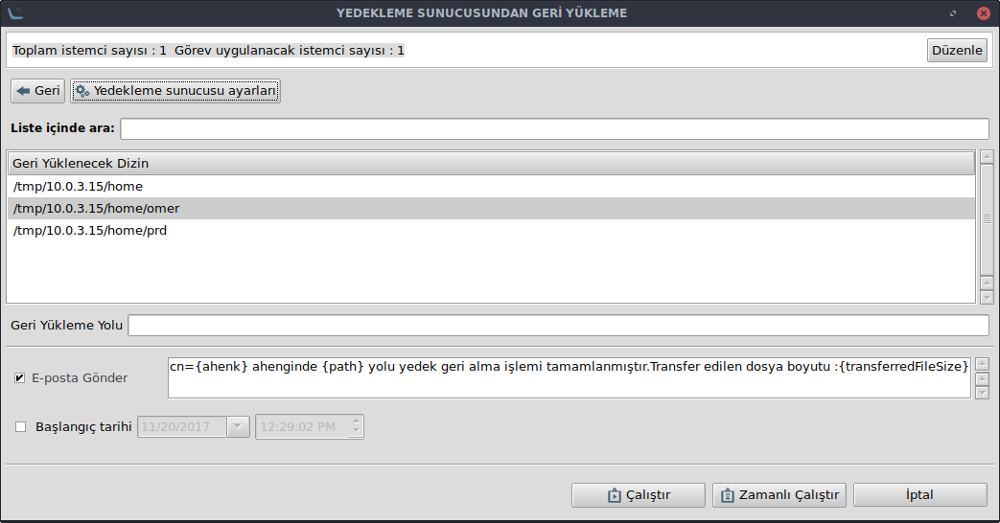

# Geri Yükle Eklentisi

Yedekleme eklentisi ile alınan yedekten dosya ve  dizin bazında geri yükleme işlemi için kullanılır. Geri yükle ekranı açıldığında yedekleme sunucu ayarlarında girilen adresteki tüm yedekleri listeler.

Ekranda listelenen yedeklerden geri yükleme işlemini yapmak istediğiniz dosya veya dizinleri seçerek geri yükleme yapabilirsiniz. **Herhangi bir yol belirtilmediği taktirde geri yükleme yolu yedek alınan yoldur.** Yani dosya /home/kullanıcı yolundan yedek alındı ise yine bu adrese geri yüklenir. Eğer farklı bir adrese geri yüklenme isteği varsa **Geri Yükleme Yolu** girilerek belirlenen adrese yükleme yapılabilir.

Geri yükleme yapılacak dosya aynı adreste varsa içeriği silmeden değişiklikleri üzerine uygular. Yani dosya içeriğini bozmadan geri yükleme yapar.

Boyut(Geri yükleme zamanını artıran bir sebeptir), dosya-dizin veya gizli dosya farketmeksizin geri yükleme yapılabilir.
