# Lider Arayüz Kullanımı

Lider Arayüz (Lider Konsol ); merkezi yönetim sisteminin sistem yöneticileri tarafından kullanılan arayüz uygulamasıdır.

Sistem yöneticileri kullanıcı ve sistemler üzerindeki görev ve politikaları bu uygulama aracılığı ile gerçekleştirirler. Bu uygulama bir Eclipse RCP uygulaması olarak geliştirilmiştir. 

## Lider Arayüz Giriş
Lider Arayüz, Apache  LDAP  Directory  ağacı  üzerinden  sistemlere  ve  kullanıcılara  erişir. Ekranın sol alt köşesindeki bağlantılar penceresi ile yeni bağlantı oluşturulur.


**Bağlantı adı**, **Sunucu Adı** ve **Port** bilgileri girilerek **Ağ Parametresini Kontrol Et** butonuna tıklanır. Bu işlem sonucunda eğer girilen veriler doğru ise ""**Bağlantı baraşıyla kuruldu**"" sonucu alınır. Sonuç olumsuz ise ldap sunucu ip ve portlara erişim kontrol edilerek tekrar denenmelidir.


Daha sonra Lider Arayüzü yönetecek ldap üzerinde tanımlı ve gerekli yetkilere(Görev ve Politika oluşturma yetkileri) sahip kullanıcı bilgileri girilir.

**Kimlik Doğrula** butonu ile gililen bilgilerin doğruluğu kontrol edilebilir.


**Kök DSE'den DN leri Getir** onayı kaldırılarak **Kök DN leri Getir** butonuna tıklanır. Kök Dn geldikten sonra **Finish** butonuna tıklanır.

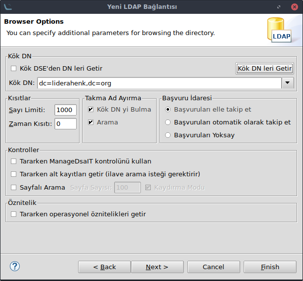

Bu işlemlerden sonra ekranın sol alt köşesinde yeni bir bağlantı oluşur.


Bağlantı üzerine çitf tıklayarak giriş yapabilirsiniz. 

Giriş işleminden sonra oluşacak sistem günceleri ekranın sağ tarafında gösterilmektedir.


Görevler, sonucunda oluşan geri bildirimler, eksik girilen veriler vs tüm bilgiler bu ekran izlenebilir. Ekranda verillen bilgilere göre gerekli düzenlemeler yapılmalıdır.

## Lider Arayüz Yetkilendirme
Lider Arayüz kullanımına geçmeden önce arayüz yetkilendirmeden bahsetmek gerekir. Lider Arayüz üzerindeki eklentiler ve görevlerin kullanımı kullanıcı bazlı yetkilendirilebilir. 

Örneğin USB yetkilendirme, yedekleme vs ayrı birer kullanıcıya atanabilir, böylelikle herbir yetki ayrı kişilerce yönetilebilir durumdadır.

Bunun için Lider Arayüz üzerinde LDAP'ta okuma-yazma yetkisine sahip bir kullanıcı ile oturum açılmalıdır.

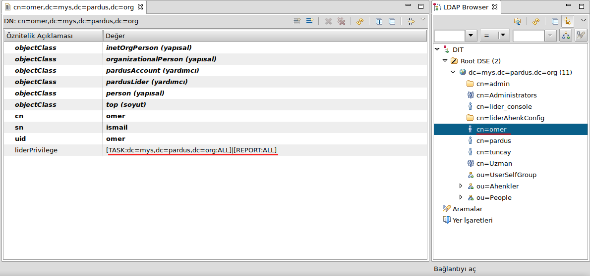

Ekranın sağındaki ldap ağacından yetki verilmek istenen kullanıcı seçilir. Ekranın sol tarafındaki **liderPrivilge** karşısındaki değere çift tıklanır.

 * **Rapor Ayrıcalıkları**
Seçili kullanıcının raporlar ile ilgili ayrıcalıkları işaretlenir.


 * **Görev Ayrıcalıkları**
Kullanıcının uygulayabileceği görevler işaretlenir. Bir eklentinin tamamı  veya sadace o eklentiye ait bir görev seçilebilir.


Örneğin USB ile ilgili yetkiler işaretlenir.

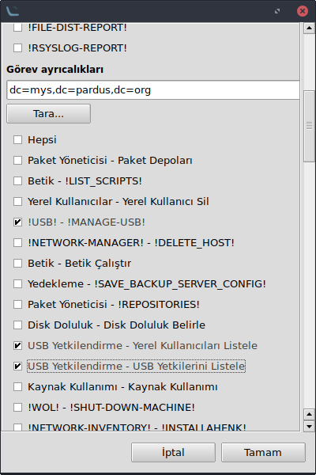

Bu işlemler sonrasında **Tamam** butonuna tıklanır. Verilen yetkiye göre **liderPrivilege** satırının güncellendiği görülebilir.

Yetkilendirilen kullanıcı Lider Arayüz ile oturum açtığında yetkisi olmayan bir göreve tıkladığında ekranın sağındaki **Sistem Güncesi** 'inde yetkisi olmadığına dair bir uyarı ile karşılaşır.

Kullanım esnasında bu şekilde bir uyarı ile karşılaşıldığında Ldap'ta okuma yazma yetkisine sahip kullanıcı ile giriş yapılarak istenilen görevlere yukarıdaki şekilde yetki tanımlanabilir.


## Lider Ahenk LDAP Ağacı

Kullanıcılar Ldap yöneticisi tarafından eklendikten sonra, ahenkler ise sisteme kayıt olduktan sonra ldap ağacında görüntülenir.


### Kullanıcılar

Kullanıcılar Ldap üzerindeki grupları(varsa) ile birlikte listelenirler. Üzerine tıklayarak kullanıcılar üzerinde yürütülen görevler-politikalar uygulanabilir.

### Ahenkler

Ahenkler kullanıcılardan bağımsız bir grup yapısında olabilir. Yine grup bilgileri ldap üzerinden alınır. Ağaç üzerindeki yerini sistem yöneticisi belirler.

Aktif ahenkler yeşil, pasifler kırmızı ile renklendirilmektedir. 

### Arama

Kullanıcı veya Ahenk aranmak istendiğinde ldap düğümü üzerine tıklanarak cn,dn,uid.... bilgilerinden biri girilerek arama yapılabilir. Sonuçlar **Arama Sonuçları** başlığında listelenir.


Ayrıca bulunan kullanıcı veya ahenk'in ldap hiyerarşisi ekranın altında listelenir.

## Kullanım Öncesi

Kullanım öncesi mail ayarları ve kullanım sonrasında kullanılabilecek raporlamalar, sonuç izleme ekranları gibi özellikler **Lider** menüsünden yapılmaktadır.

### Lider Menü

Bu menüdeki seçenekler;


**Politika Tanımları:** Sistemin genelinde kullanılacak politikalar buradan tanımlanır. **Lider Yönetim Paneli**'nde bu ekrana hızlı erişim bulunmaktadır.

**Ahenk Bilgisi:** Sistemdeki ahenkler ip, mac adresi vb bilgiler ile listelenir. İncelenmek istenen ahenk'e tıklandığında o ahenk'in öznitelikleri  ve o ahenk üzerinden oturum açan kullanıcıların bilgilerini görüntülenir. Ahenk üzerinde kullanıcıların ne zaman oturum açıp ne zaman sonlandırdığına buradan bakılabilir.

**E-Posta Ayarları:** Herbir eklenti için sistem yöneticilerine, kullanıcılara veya e-posta guruplarına işlem ve sonucu hakkında e-posta bildirimi yapılabilir.


Bunu için eklenti seçilerek e-posta adresleri **Mail Gurubu Tanımla** alanına girilerek eklenir. E-posta gönderimi **Zamanlanmış Gönder** veya **Hemen Gönder** olarak ayarlanabilir.

Bütün bu ayarlardan sonra **Mail Konfigurasyonunu Kaydet** butonuna **MUTLAKA** tıklanmalıdır.

**Çalıştırılan Görevler:** Sistem üzerinde çalışan ve tamamlanmış tüm görevler bu ekranda listelenir.


Süreci devam eden görevler iptal edilebilir. İleri tarihli veya zamanlı çalıştırılan görevler ayrı ayrı takip edilebilir.

**Uygulanan Politikalar:** Görevlerde olduğu gibi sistemde uygulanan politikalar bu ekranda listelenir.


**Ldap Arama:** Arama kapsamı ve arama kriteri girilerek ahenk veya kullanıcı araması yapılabilir.


Birden fazla arama kriteri için "+" butonuna tıklanarak ilgili alanlar girilmelidir.

**Lider'e Yüklenen Eklentiler:** Lider üzerinde yüklü olan eklentiler bu ekrandan incelenebilir.


Eklentiler için versiyon kontrolu, kullanıcı-makine odaklı ve politika-görev özellikleri bu ekrandan takip edebilirsiniz.

**Raporlama:** İleride [Raporlama](#Raporlama) başlığında detaylı bir şekilde değinilmiştir.

**USB Yetkilerini Listele:** *USB Yetkisi Ver/Kaldır* eklentisi ile verilen yetki ver/kaldır görevlerinin sonuçları bu ekrandan izlenir.


Yetki verilenler veya yetkisi alınan kullanıcılar ayrı ayrı süzülebilir. Kullanıcın yetkisini değiştirmek için *USB Yetkisi Ver/Kaldır* eklentisi kullanılmalıdır, bu ekranda sadece görüntüleme yapılır.

**Servis İzleme Listesi:** *Servis İzle ve Yönet* eklentisi çalıştırıldıktan sonra oluşan geri bildirimler bu ekranda istelenir.


Herhangi bir izeleme görevin üzerine çift tıklandığında görevin sonuçları görüntülenir.

**Servis Raporu:** Servis genel raporlama ekranıdır. Arama kriterleri girilmediği taktirde tüm ahenkler üzerinde çalışan servisleri aktif-pasif durumları ile birlikte getirir.


Örneğin servis durumu "Stopped" olan servisler süzülebilir. Veya ssh, cups, cron vs servisin hangi ahenkler üzerinde durduğu bilgisine buradan ulaşılabilir.


Tüm ahenkler üzerinde çalışan bir servisin durumu hakkında bilgi alınabilir.

**Betik Tanımları:** Sistem genelinde kullanılan betikleri bu ekrandan tanımlanır. **Bash, Python, Perl, Ruby** betikleri yazılabilir.

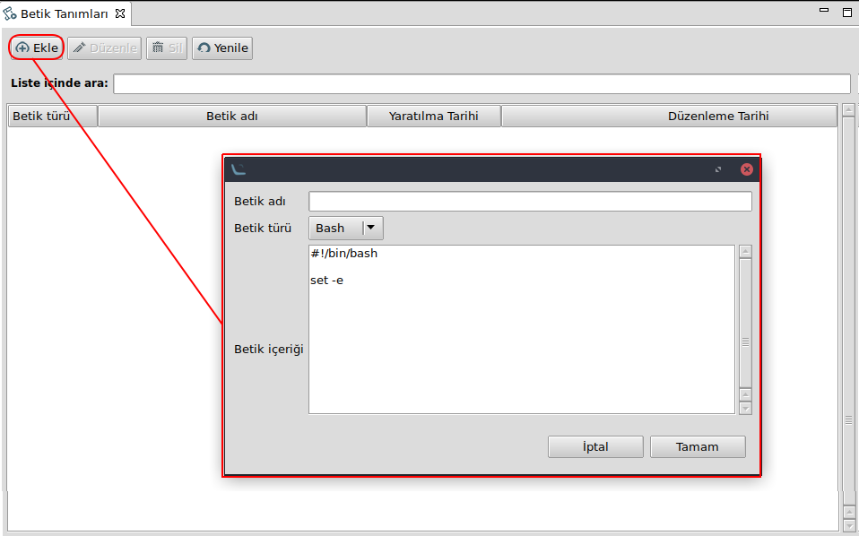

Burada yazılan betikler görev eklentisi olarak uygulanmaktadır.

**Paket Yöneticisi Görevler Ekranı:** Paket Kur/Kaldır görevi sonuçları bu ekranda listelenir.

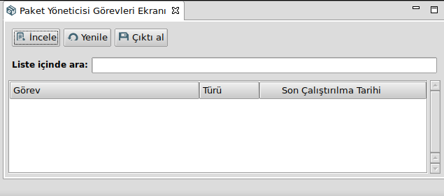

Görevin çalıştırıldığı ahenkler ve başarı durumu, gönderilen görevin üzerine çift tıklayarak veya **İncele** butonuna tıklayarak görülebilir.

**Disk Kota Politikası Ekranı:** Kullanıcı, grup veya birimin tamamı veya birkaç karakteri girilerek arama yapılır. Bulunan kullanıcı/gurup/birim üzerine tıklandığında o kullanıcıya uygulanan politika listelenir.

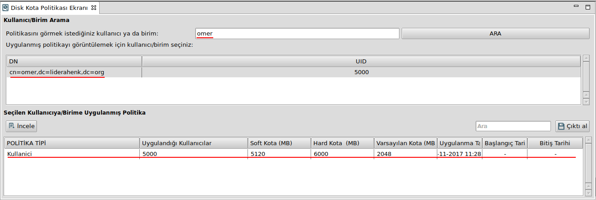

Listelenen politikaların üzerine çift tıklanılarak ceya **İncele** butonuna tıklanılarak uygulanan DN'ler ve hata/başarı oranları görülebilir.

**Yedekleme Görevleri Ekranı:** Yedekleme görevleri çalıştırıldıktan sonra (yedekleme uzun sürebilir) bu ekrandan takip edilebilir.

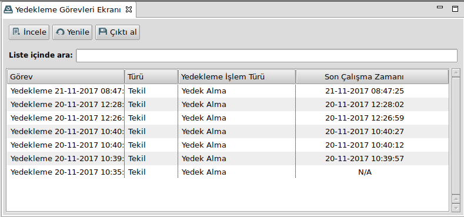

Uygulanan ahenklere ait yedekleme sonuçları, anlık olarak izlenebilir. Tamamlanan veya devam edenlerin tamamlanma oranları, transfer edilen dosya boyutu, ulaşmayan ahenkler bu ekrandan görülebilir.


**Yedekleme Sunucu Konfigurasyonu:** *Dizin Yedekle* görevi uygulanırken girilen yedekleme ayarları bu ekrandan da düzenlenebilir.


Değiştirilen ayarlar sistemin genelinde aktif olur.

## Görev Uygulama

*Lider Ahenk LDAP Ağacı* üzerindeki kullanıcı, grup ve ahenkler üzerine anlık olarak gönderilmek istenen işlemler **görev** olarak adlandırılır.

Kullanıcı ve kullanıcı grupları üzerine uygulanacak görevler ile ahenkler üzerine uygulanan görevler farklılık göstermektedir. Lider Arayüz bu farklılıkları kullanıcıya hissettirmeden yapmakta, kullanıcıya uygulanacak eklenti ahenkler üzerinde aktif olmamaktadır.

Fakat bazı eklentiler hem görev hemde politika olarak uygulanabilmektedir.

Görev uygulama adımları;

 * *Lider Ahenk LDAP Ağacı* üzerinden kullanıcı/grup seçimi yapılır
 * *Lider Yönetim Paneli*  üzerinden uygulanmak istenen görev eklentisi butonuna basılır
 * Eklenti türüne göre gerekli adımlar takip edilir.

Herbir eklentinin uygulanış biçimi farklı olabilir. Bu nedenle **Lider Ahenk Dokümanlar** adresinden [Eklentiler](http://docs.liderahenk.org/) başlığı altından kullanılmak istenen eklenti incelenebilir.

## Politika Uygulama

Herbir politika en az bir profilden oluşmaktadır. Profiller topluluğu ise politikaları oluşturur.


*+* simgesi ile yeni bir politika oluşturulur. Kalem butonu ile seçili politika üzerinde profil tanımlama ekranı açılır.

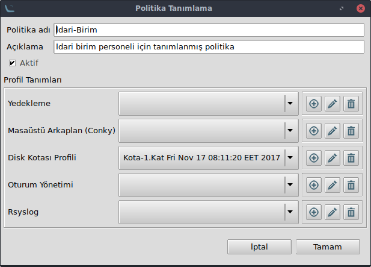

Profiller için **Lider Ahenk Dokümanlar** adresinden [Eklentiler](http://docs.liderahenk.org/) başlığı altından kullanılmak istenen eklenti incelenebilir. Bu ekranda gelen eklentiler sistemde yüklü olan ve profil olarak oluşturulup, politika şeklinde uygulanabilen eklentilerdir.

Örneğin **Masaüstü Arkaplan** eklentisi bir görev olarak uygulanabildiği gibi kullanıcı nerede oturum açarsa açsın karşısına çıkacak bir profil olarak da buradan tanımlanbilir. **Profiller uygulandıktan sonra kullanıcı oturumlarının kapatılıp açılması gereklidir.**

Daha sonra kullanılmak üzere tanımlanan,  henüz kullanımı düşünülmeyen veya geçici olarak iptal edilmek istenen politikalar **Aktif** onayı kaldırılarak pasif edilebilir.

Tanımlanmış profiller açılır menüden değiştirilebilir, eklenebilir, düzenlenebilir ve silinebilir durumdadır. Aktif-Pasif edilebilme tüm profiller için geçerlidir.

## Raporlama

Raporlama 2 adımdan oluşmaktadır. Önce rapor için şablon oluşturulur. Daha sonra bu şablon üzerinden rapor tanımları yapılır. Herbir şablon için birden fazla rapor tanımı yapılabilir. Gösterilecek değerler, ekranda listelenedek veriler değişiklik göstereceği  için rapor tanımları ve şablonlar esnek yapıdadır.

### Rapor Şablonları

Bu ekranda karşınıza gelen raporlar sistem yöneticisinin sık kullanacağı düşünülerek hazırlanmış raporlardır.


Üzerine çift tıklayarak silebilir, düzenleyebilir veya *Ekle* butonuna tıklayarak ekleyebilirsiniz.


Ekleme işleminde en önemli adım sql sorgusunun hazılanmasıdır. Sorgu hazırlandıktan sonra buraya eklenir, çalışabilirliğinin testi **Sorguyu Doğrula** butonu ile yapılabilir.

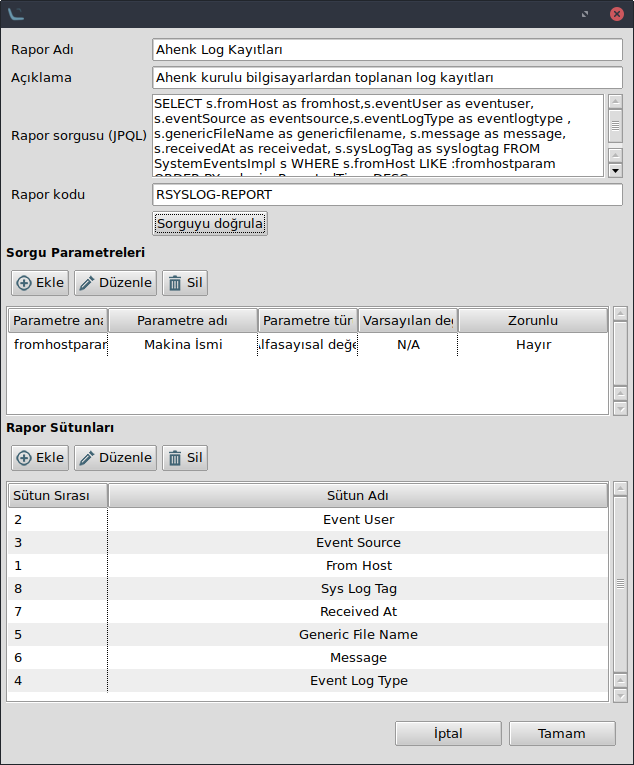

Sorguda verilen parametreler ve sorgu sonucu oluşması beklenen sütünlar tanımlanır.

### Rapor Tanımları

Rapor tanımları şablonlardan alınan verinin hangisinin, nerede gösterileceği ve çıktısının ne olacağının belirlendiği ekrandır.

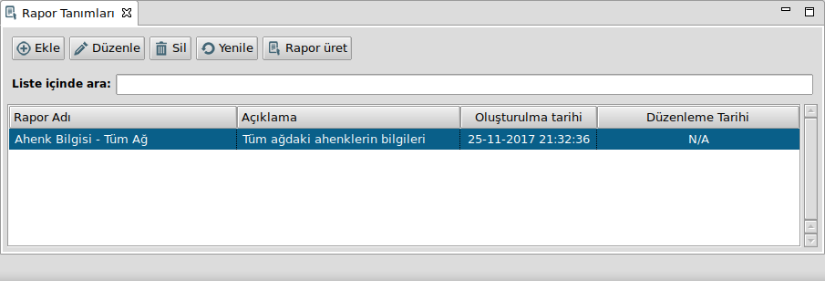

Daha önce hazırlanan raporun çıktısı alınmak istendiğinde **Rapor Üret** butonuna tıklanmalıdır. Yeni bir rapor tanımlamak için **Ekle** butonuna tıklanır.

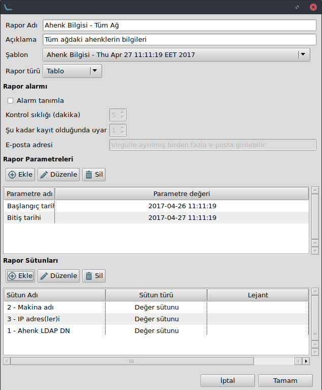

Kullanılacak şablon seçilir, rapor türü (Tablo,Sütun Gratik, Çizgi Grafik) belirlenir. Rapor parametreleri ve sütünları şablonda belirlenen alanlar otomatik olarak gelir.


Hangi parametreler ile raporda hangi sütunların hangi sıra ile gösterileceği belirlenerek **Tamam** butonuna tıklanır.

Bu işlemlerden sonra **Rapor Tanımları** ekranında ilgili rapor seçilerek **Rapor Üret** butonuna tıklanır. Çıktı sadece ekranda gösterilmek isteniyorsa **Burada göster** seçeneğine tıklanır.


Çıktı pdf olarak alınmak istendiğinde pdf sayfasında olması istenilen rapor tasarımı ile alakalı Tarih, Sayfa numarası veya rapor üreten tarafından belirlenen bir metin rapor tasarımına eklenebilir.

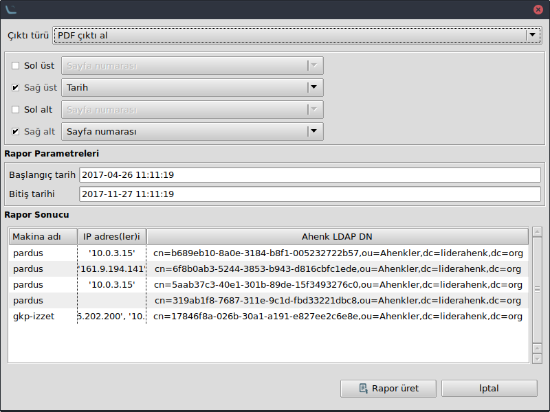

Bu işlemler sonucunda **Rapor Üret** butonuna tıklanır, oluşturulan pdf dosyasının adı ve nereye kaydedileceği bilgisi alınarak rapor oluşturma işlemi tamamlanmış olur.

#LiderArayüz - Eklenti Ekleme#
**LiderArayüz Github Sayfası**‘ında tüm eklentileri içeren bir sürüm (**Lider.Console.Core- linux.gtk.x86_64_all-1.1.tar.gz**) ve eklentisiz bir sürüm(**Lider.Console.Core-linux.gtk.x86_64_1.1.tar.gz**) yayınlanmaktadır. Boş bir **LiderArayüz**’e eklenti ekleme adımları anlatılacaktır.

LiderAhenk Github Sayfası [LiderArayüz](https://github.com/Pardus-LiderAhenk/lider-console/releases/download/v1.1/Lider.Console.Core-linux.gtk.x86_64_1.1.tar.gz) adresinden uygulamanın boş halini indirerek sağ tıklanır ve arşivden çıkartılır.

[Eklentiler](https://github.com/Pardus-LiderAhenk?utf8=%E2%9C%93&q=plugin&type=&language=) LiderAhenk **Github** sayfasında sunulmaktadır. Eklenmek istenen eklenti için **releases**'a tıklanır ve **.zip** dosyası indirilir. Sağ tıklanarak arşivden çıkarılır.

Eklentisiz LiderArayüz ve eklenti inidirildikten sonra **lider-console** çalıştırılabilir dosyasına çift tıklanarak çalıştırılır.


**Yardım > Yeni Eklenti Yükle..** yolu izlenir.

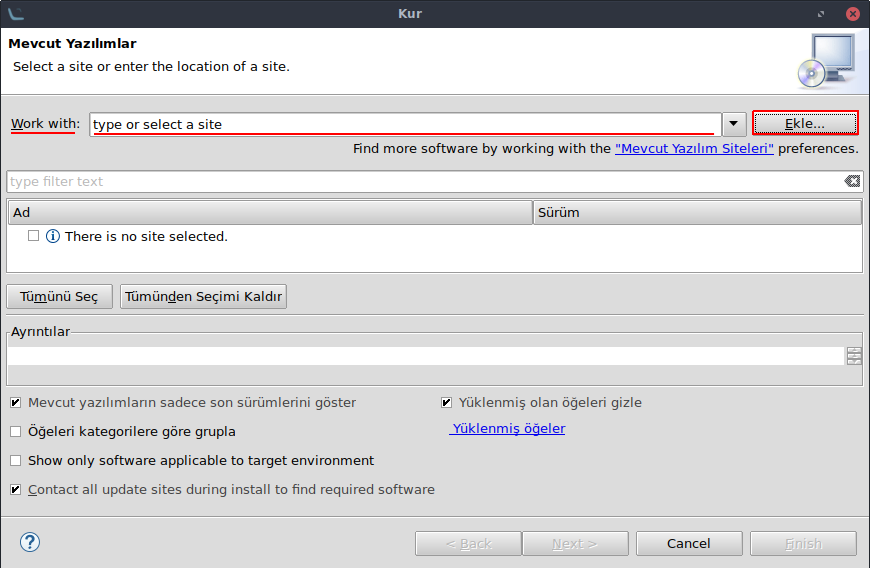

**Ekle** simgesine tıklanır.

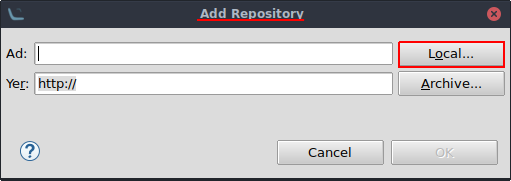

Local.. simgesine tıklanır. Eklentinin bulunduğu dizinde(Örnek olarak Manage-Root eklentisi baz alınmıştır)

```
lider-ahenk-manage-root/lider-console-manage-root-feature/target/site/
```

şeklinde **site** dizinine kadar inilerek bu dizin seçili halde iken **Tamam** butonuna tıklanır.


Daha sonra **OK** butonuna tıklanır. Daha sonra eklenti ismi ve sürümü ile birlikte görüntülenir.


Eklenti seçilerek **Next** butonuna tıklanır.


Yükleme detayları ekranında **Next** butonuna tıklanarak ilerlenir.

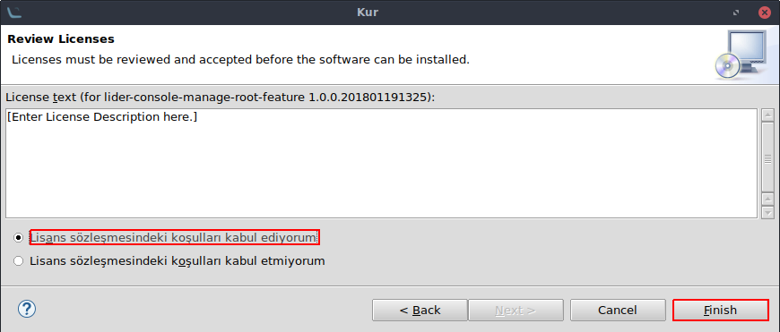

Lisans sözleşmesi onayı verilerek **Finish** butonuna tıklanır.
```
Not: Güvenlik uyarısına **OK** butonuna tıklanarak devam edilir.
```


Eklenti kurulumu tamanlandı. Uygulamanın yeniden başlayarak eklenti ile birlikte çalışması sağlanır. Bunun için **Yes** butonuna tıklanır.


Yeniden başlayan uygulama ile bağlantı açılarak herhangi bir **ahenk-kullanıcı** üzerine tıklandığında görev listesinde yeni eklenen eklenti görülebilir.


