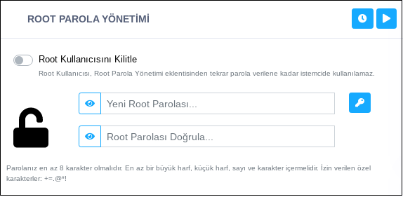

**Root Parola Yönetimi**

Root Kullanıcısı, root parola yönetimi eklentisinden tekrar parola verilene kadar istemcide kullanılamaz hale getirilebilir. Root parolası sıfırlanabilir. Yeni oluşturulacak parolada en az 8 karakter olmalıdır. En az bir büyük harf, küçük harf, sayı ve karakter içermelidir. İzin verilen özel karakterler: +=.@*!

 