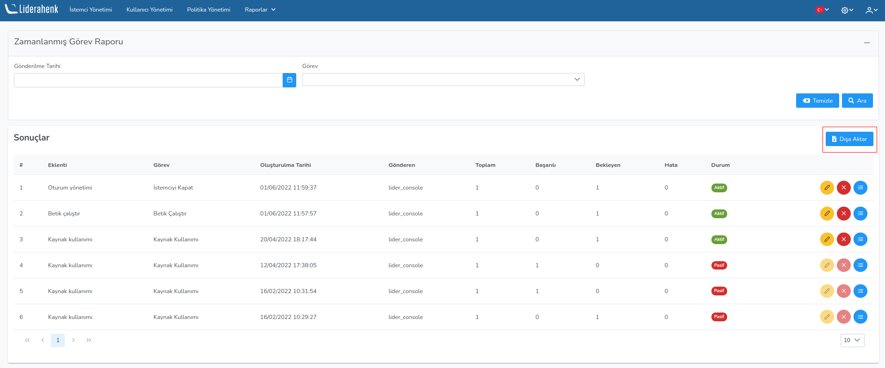
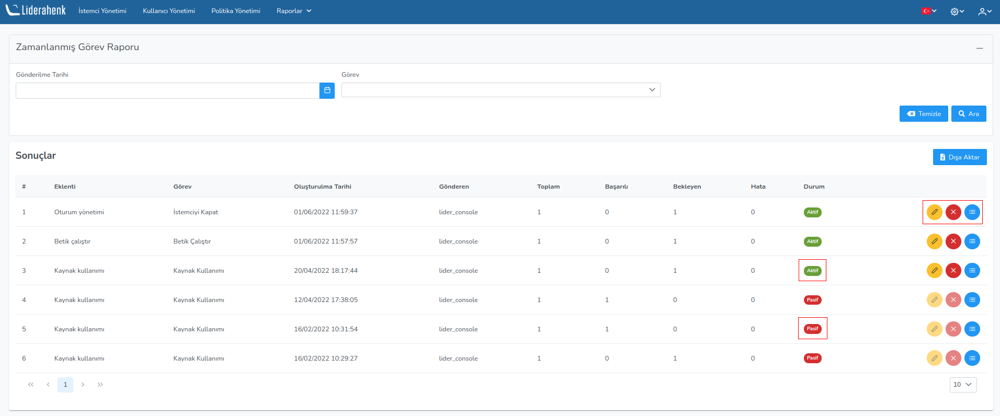
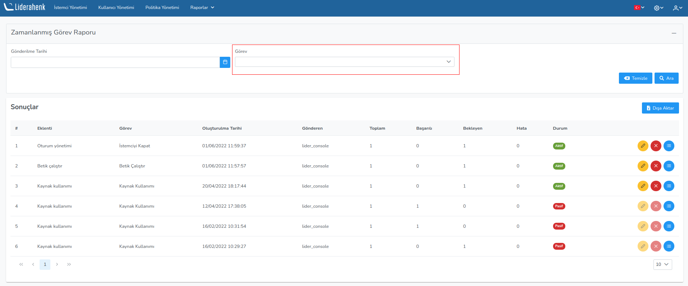

**Zamanlanmış Görev Raporu**

Sistem güncesi kısmında istemciler üzerinde çalıştırılan: günce tipi, oluşturulma tarihi, mesaj, kullanıcı adı,
IP adresi bilgileri tabloda gözlemlenir.

Dışa Aktar butonu ile bütün Zamanlanmış Görev bilgileri Excel formatında dışa aktarılır.

Listelenmiş zamanlanmış görevler hakkında detaylı bilgi almak için ilgili butona tıklayarak zamanlamış
görevlerle alakalı detaylı bilgi alabilir, silebilir veya düzenleyebilirsiniz.

Zamanlanmış görev Görev tipine göre filtrelendirilebilir.

Zamanlanmış görev Gönderilme tarihine göre filtrelendirilebilir.
 

