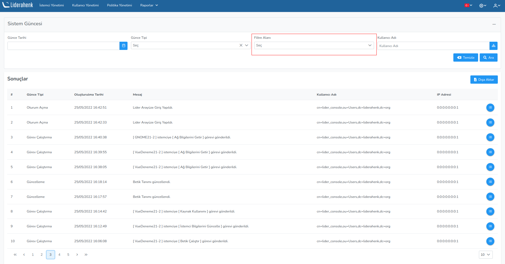
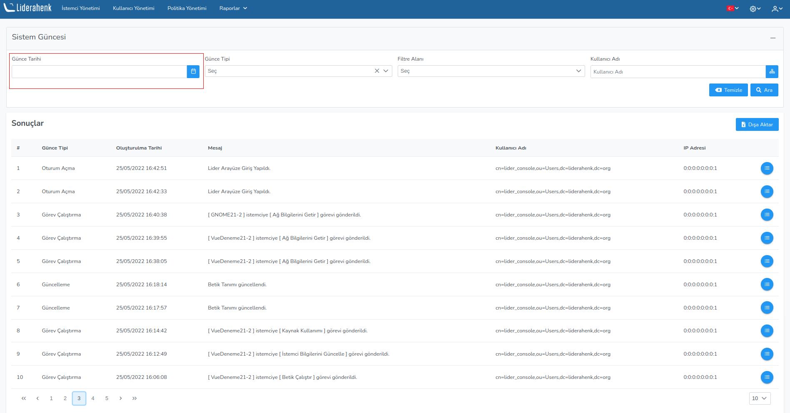

**Sistem Güncesi Raporu**

Sistem güncesi kısmında istemciler üzerinde çalıştırılan: günce tipi, oluşturulma tarihi, mesaj, kullanıcı adı,
IP adresi bilgileri tabloda gözlemlenir.

Dışa Aktar butonu ile bütün Sistem Güncesi bilgileri Excel formatında dışa aktarılır.

Listelenmiş sistem günceleri hakkında detaylı bilgi almak için ilgili butona tıklayarak günce detayları 
gözlemlenebilir.
 

Sistem günceleri Filtre Alanı kısmında Kullanıcı Adı veya IP adresine göre filtrelendirilebilir.

Filtre Alanı kısmında kullanıcı adı seçeneği seçildiğinde: kullanıcının adının manuel girebilir yada
 mevcut ağaç yapısından seçilir. Ardından ara butonuna tıklayarak filtrelendirme yapılır.
 
Filtre Alanı kısmında IP adresi seçeneği seçilmiş ise istenen IP girilir ve ardından ara butonuna 
tıklayarak filtrelendirme yapılır.
 

Sistem günceleri Günce Tarihine göre filtrelendirilebilir.

Sistem günceleri Günce Tipine göre filtrelendirilebilir.

