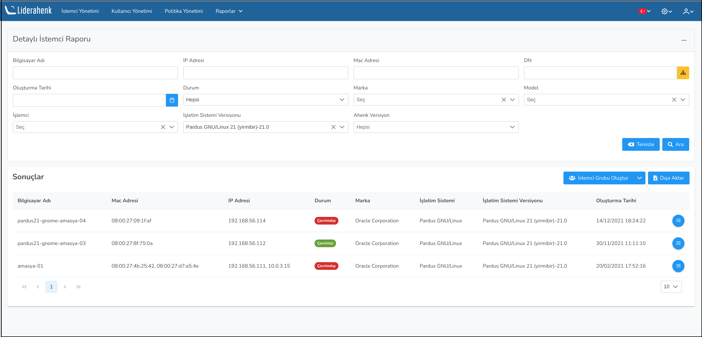

**RAPORLAR**

Liderahenk Merkezi Yönetim Sistemine kayıt olan istemcilere ait detaylı arama yapılarak rapor alınabilmekte ve arama sonuçlarına göre İstemci Grubu oluşturulabilmektedir. Lider üzerinde istemcilere gönderilen görev detayları sorgulabilmektedir. 
Ayrıca Zamanlanmış olarak göndeirlen görevlere ait rapor oluşturulabilmekte, tekrar düzenlenebilmekte ve iptal edilebilmektedir.

**Detaylı İstemci Raporu**

**Çalıştırılan Görev Raporu**

**Sistem Güncesi Raporu**

**Zamanlanmış Görev Raporu**

