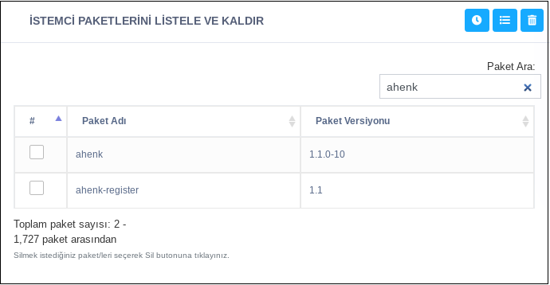

**İstemci Paketlerini Listele Ve Kaldır**

Makinede çalışan bu görev, belirtilen bir ya da daha fazla deponun içeriğindeki paketleri listeler. Listelenen bu paketler arasından bir ya da daha çok paket şeçilip yükleme/kaldırma işlemleri yapılabilir.

