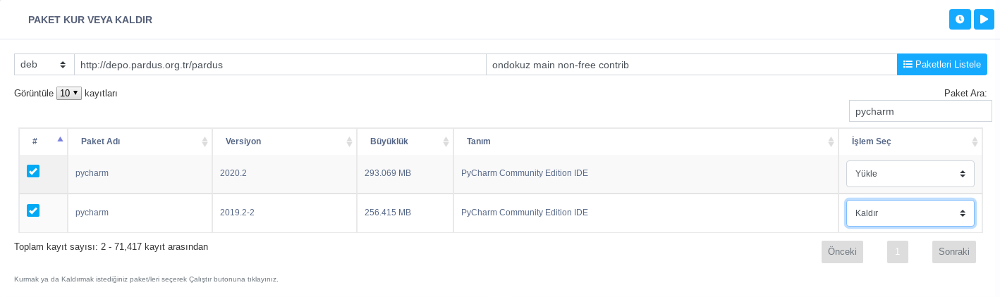

**Paket Kur Veya Kaldır**

Bir Ahenk makine için çalışan bu görev, makinedeki tüm paketleri yüklü olup olmadığı bilgisiyle kullanıcıya sunar.Kulanıcı buradan istenen durum bilgisini değiştirerek her bir paket için yükleme ve kaldırma işlemi yapabilmektedir. İstenen durum bilgisini değiştirmek için ilgili kolun tıklanılmalı ve açılan menüden "Yükle" veya "Kaldır" seçeneklerinden biri seçilmelidir. Aynı anda birden çok paket işlemi yapılabilmektedir. Paket sorgulandığında kaldırıldığı görülebilir. 

